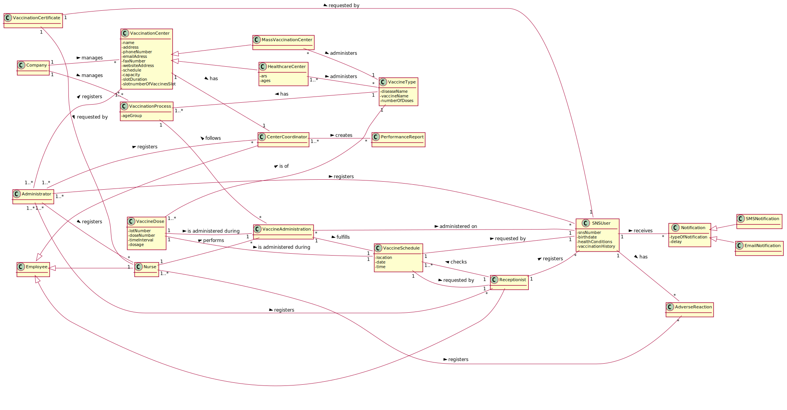

# OO Analysis #

The construction process of the domain model is based on the client specifications, especially the nouns (for _concepts_) and verbs (for _relations_) used. 

## Rationale to identify domain conceptual classes ##
To identify domain conceptual classes, start by making a list of candidate conceptual classes inspired by the list of categories suggested in the book "Applying UML and Patterns: An Introduction to Object-Oriented Analysis and Design and Iterative Development". 

### _Conceptual Class Category List_ ###

**Business Transactions**

* Vaccine Administration

---

**Transaction Line Items**

* Vaccine

---

**Product/Service related to a Transaction or Transaction Line Item**

* Vaccine
* Vaccination Certificate

---

**Transaction Records**

*  

---  

**Roles of People or Organizations**

* SNS User
* Nurse
* Receptionist
* Center Coordinator
* Administrator

---

**Places**

* Mass Vaccination Center
* Health Center

---

**Noteworthy Events**

* Schedule Vaccine
* Vaccine Administration
* Adverse Reaction

---

**Physical Objects**

* Vaccine Dose
* Vaccination Certificate

---

**Descriptions of Things**

* Vaccine Type

---

**Catalogs**

*  

---

**Containers**

*

---

**Elements of Containers**

* 

---

**Organizations**

* DGS
* ACES
* ARS

---

**Other External/Collaborating Systems**

* 

---

**Records of finance, work, contracts, legal matters**

* 

---

**Financial Instruments**

*  

---

**Documents mentioned/used to perform some work/**

* 
---

###**Rationale to identify associations between conceptual classes**

| Concept (A) 		          |    Association   	     |            Concept (B) |
|-------------------------|:----------------------:|-----------------------:|
| Receptionist            |       registers        |               SNS User |
| Receptionist            |         checks         |        VaccineSchedule |
| Receptionist            |          is a          |               Employee |
| SNS User                |          has           |       Adverse Reaction |
| SNS User                |        receives        |           Notification |
| Vaccine Dose            | is administered during |       Vaccine Schedule |
| DGS                     |        manages         |    Vaccination Process |
| Mass Vaccination Center |       administers      |           Vaccine Type |
| Healthcare Center       |       administers      |           Vaccine Type |
| Vaccination Center      |          has           |     Center Coordinator |
| Center Coordinator      |         creates        |    Performance Reports |
| Center Coordinator      |          is a          |               Employee |
| Vaccination Certificate |      requested by      |               SNS User |
| Vaccination Certificate |      requested by      |                  Nurse |
| Nurse                   |        registers       |       Adverse Reaction |
| Nurse                   |          is a          |               Employee |
| Nurse                   |        performs        | Vaccine Administration |
| Vaccine Administration  |        fulfills        |       Vaccine Schedule |
| Vaccine Schedule        |       requested by     |           Receptionist |
| Vaccine Schedule        |       requested by     |               SNS User |
| Email Notification      |          is a          |           Notification |
| SMS Notification        |          is a          |           Notification |
| Vaccination Process     |   is carried out by    |     Vaccination Center | 
| Vaccination Process     |          has           |           Vaccine Type |
| Vaccination Process     |        follows         | Vaccine Administration | 
| Vaccine Dose            | is administered during | Vaccine Administration |
| Administrator           |       registers        |                  Nurse |
| Administrator           |       registers        |           Receptionist |
| Administrator           |       registers        |     Vaccination Center |
| Administrator           |       registers        |     Center Coordinator |
| Administrator           |       registers        |               SNS User |
| Mass Vaccination Center |          is a          |     Vaccination Center |
| HealthCare Center       |          is a          |     Vaccination Center |
| Vaccine Dose            |          is of         |           Vaccine Type |

## Domain Model

**Do NOT forget to identify concepts atributes too.**

**Insert below the Domain Model Diagram in SVG format**

