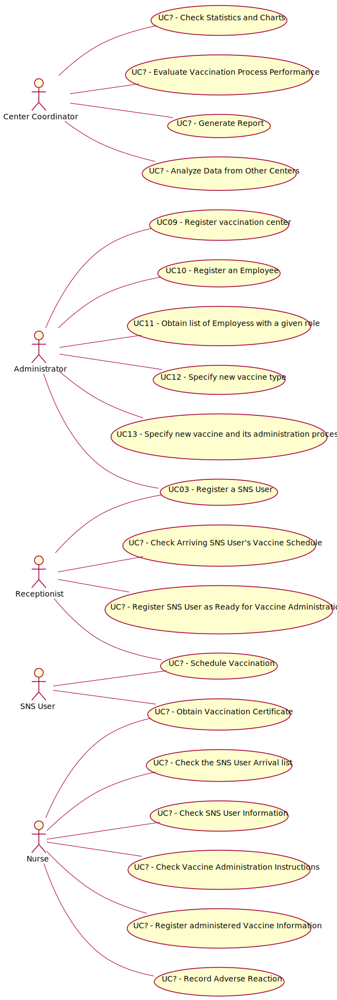

# Use Case Diagram (UCD)

**In the scope of this project, there is a direct relationship of _1 to 1_ between Use Cases (UC) and User Stories (US).**

However, be aware, this is a pedagogical simplification. On further projects and curricular units might also exist _1 to N **and/or** N to 1 relationships between US and UC.

**Insert below the Use Case Diagram in a SVG format**

**For each UC/US, it must be provided evidences of applying main activities of the software development process (requirements, analysis, design, tests and code). Gather those evidences on a separate file for each UC/US and set up a link as suggested below.**

# Use Cases / User Stories
| UC/US  | Description                                               |                   
|:----|:----------------------------------------------------------|
| US 001 | [SNS User obtains vaccination certificate](US001.md)      |
| US 002 | [Nurse delivers vaccination certificate](US002.md)        |
| US 003 | [SNS User schedules vaccination](US003.md)                |
| US 004 | [SNS User receives confirmation SMS](US004.md)            |
| ... | ...                                                       |
| US 013 | [Nurse checks the user who arrived first](US013.md)       |
| US 014 | [Nurse checks every information about the user](US014.md) |
| US 015 | [Nurse registers the given vaccine information](US015.md) |
| US 016 | [User receives a notification regarding the ending of the recovery period](US016.md) |
| US 326 | [ShortNameOfUS326](US326.md)                              |
