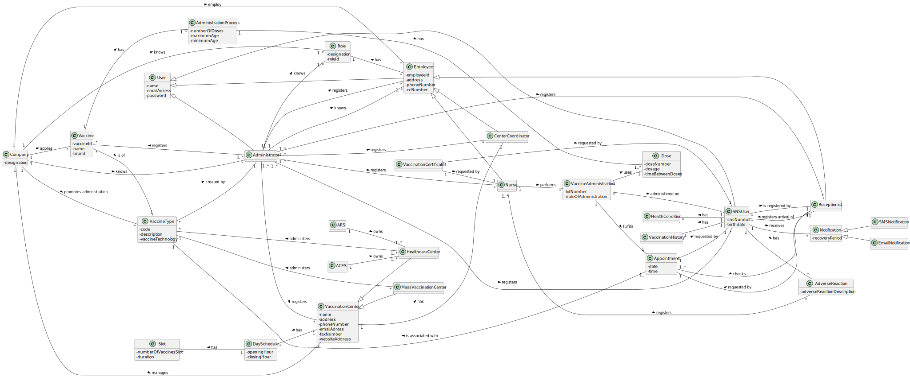

# OO Analysis #

The construction process of the domain model is based on the client specifications, especially the nouns (for _concepts_) and verbs (for _relations_) used. 

## Rationale to identify domain conceptual classes ##
To identify domain conceptual classes, start by making a list of candidate conceptual classes inspired by the list of categories suggested in the book "Applying UML and Patterns: An Introduction to Object-Oriented Analysis and Design and Iterative Development". 

### _Conceptual Class Category List_ ###

**Business Transactions**

* Vaccine Administration

---

**Transaction Line Items**

* Vaccine

---

**Product/Service related to a Transaction or Transaction Line Item**

* Vaccine
* Vaccination Certificate

---

**Transaction Records**

*  

---  

**Roles of People or Organizations**

* SNS User
* Nurse
* Receptionist
* Center Coordinator
* Administrator

---

**Places**

* Mass Vaccination Center
* Health Center

---

**Noteworthy Events**

* Schedule Vaccine
* Vaccine Administration
* Adverse Reaction
* Slot

---

**Physical Objects**

* Dose
* Vaccination Certificate

---

**Descriptions of Things**

* Vaccine Type
* Administration Process
* Role

---

**Catalogs**

*  

---

**Containers**

*

---

**Elements of Containers**

* 

---

**Organizations**

* DGS
* ACES
* ARS

---

**Other External/Collaborating Systems**

* 

---

**Records of finance, work, contracts, legal matters**

* 

---

**Financial Instruments**

*  

---

**Documents mentioned/used to perform some work/**

* 
---

###**Rationale to identify associations between conceptual classes**

| Concept (A) 		          |      Association   	       |            Concept (B) |
|-------------------------|:--------------------------:|-----------------------:|
| Receptionist            |    registers arrival of    |               SNS User |
| Receptionist            |           checks           |            Appointment |
| Receptionist            |            is a            |               Employee |
| SNS User                |            has             |       Adverse Reaction |
| SNS User                |          receives          |           Notification |
| Mass Vaccination Center |        administers         |           Vaccine Type |
| Healthcare Center       |        administers         |           Vaccine Type |
| Vaccination Center      |            has             |     Center Coordinator |
| Center Coordinator      |            is a            |               Employee |
| Vaccination Certificate |        requested by        |               SNS User |
| Vaccination Certificate |        requested by        |                  Nurse |
| Nurse                   |         registers          |       Adverse Reaction |
| Nurse                   |            is a            |               Employee |
| Nurse                   |          performs          | Vaccine Administration |
| Vaccine                 |           is of            |           Vaccine Type |
| Vaccine Administration  |          fulfills          |            Appointment |
| Appointment             |        requested by        |           Receptionist |
| Appointment             |        requested by        |               SNS User |
 | Appointment             |     is associated with     |           Vaccine Type |
| Email Notification      |            is a            |           Notification |
| SMS Notification        |            is a            |           Notification |
| Administrator           |         registers          |                  Nurse |
| Administrator           |         registers          |           Receptionist |
| Administrator           |         registers          |     Vaccination Center |
| Administrator           |         registers          |     Center Coordinator |
| Administrator           |         registers          |               SNS User |
| Mass Vaccination Center |            is a            |     Vaccination Center |
| HealthCare Center       |            is a            |     Vaccination Center |
| Day Schedule            |            has             |                   Slot |
| SNS User                |            has             |       Health Condition |
| SNS User                |            has             |    Vaccination History |
| SNS User                |      is registered by      |           Receptionist |
| ACES                    |            owns            |      Healthcare Center |
| ARS                     |            owns            |      Healthcare Center |
| Company                 |          applies           |                vaccine |
| Vaccination Center      |            has             |           Day Schedule |
| Employee                |            has             |                   Role |
| Company                 |           employ           |               Employee |
| Company                 |           knows            |          Administrator |
| Company                 |           knows            |               SNS User | 
| Administrator           |         registers          |               Employee |
| Company                 | promotes administration of |           Vaccine Type |
| Company                 |           knows            |                   Role |
| Administrator           |           knows            |               Employee |
| Administrator           |           knows            |                   Role |
| Vaccine Type            |         created by         |          Administrator |
| Administrator           |         registers          |                Vaccine |
| Administration Process  |            has             |                   Dose |
| Vaccine                 |            has             | Administration Process |
| Vaccine Administration  |            uses            |                   Dose |

## Domain Model

