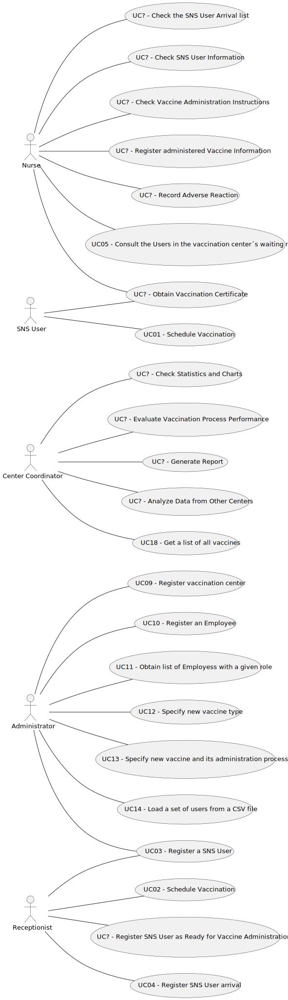

# Use Case Diagram (UCD)

**In the scope of this project, there is a direct relationship of _1 to 1_ between Use Cases (UC) and User Stories (US).**

However, be aware, this is a pedagogical simplification. On further projects and curricular units might also exist _1 to N **and/or** N to 1 relationships between US and UC.

**Insert below the Use Case Diagram in a SVG format**

**For each UC/US, it must be provided evidences of applying main activities of the software development process (requirements, analysis, design, tests and code). Gather those evidences on a separate file for each UC/US and set up a link as suggested below.**

# Use Cases / User Stories
| UC/US  | Description                                                                             |                   
|:-------|:----------------------------------------------------------------------------------------|
| US 001 | [SNS User uses the application to schedule Vaccination appointment](US001.md)           |
| US 002 | [Receptionist schedules vaccination appointment on a vaccination center](US002.md)      |
| US 003 | [Receptionist register an SNS User](US003.md)                                           |
| US 004 | [Receptionist registers the arrival of an SNS user to take the vaccine](US004.md)       |
| US 005 | [Nurse consults the users in the waiting room of a vaccination center](US005.md)        |
| US 009 | [Administrator registers vaccination center to respond to a certain pandemic](US009.md) |
| US 010 | [Administrator registers an Employee](US010.md)                                         | 
| US 011 | [Administrator gets a list of Employees with a given role](US011.md)                    |
| US 012 | [Administrator specifies new vaccine type](US012.md)                                    |
| US 013 | [Administrator specifies new vaccine and respective administration process](US013.md)   |
| US 014 | [Administrator loads a set of Users from CSV file](US014.md)                            |
| US 018 | [Center Coordinator gets a list of all vaccines](US018.md)                              |
