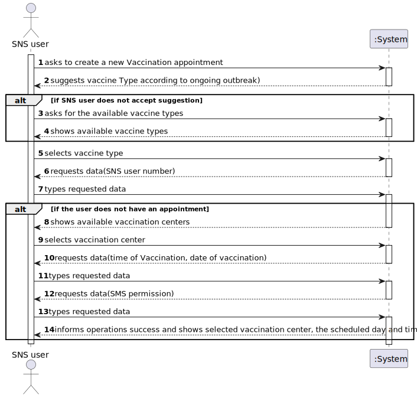
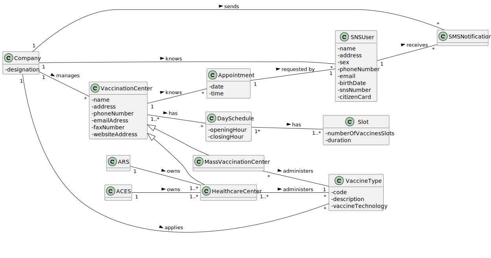
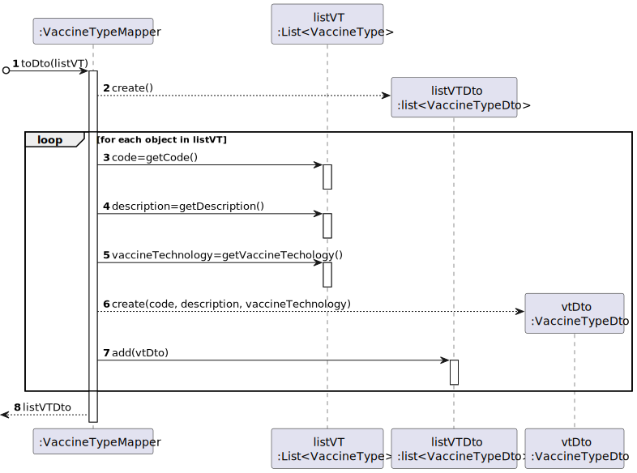
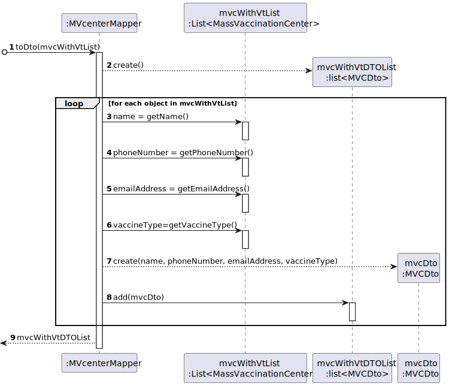
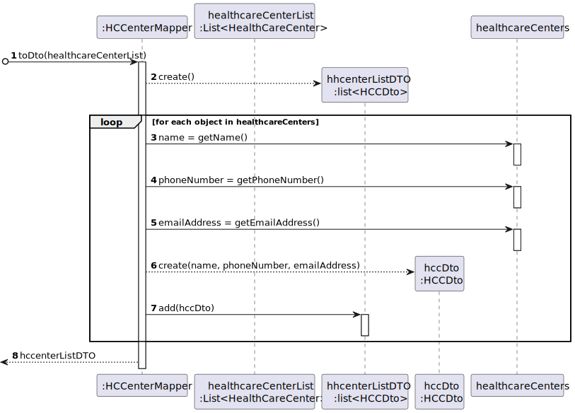
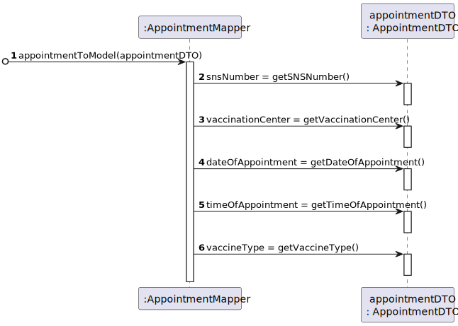
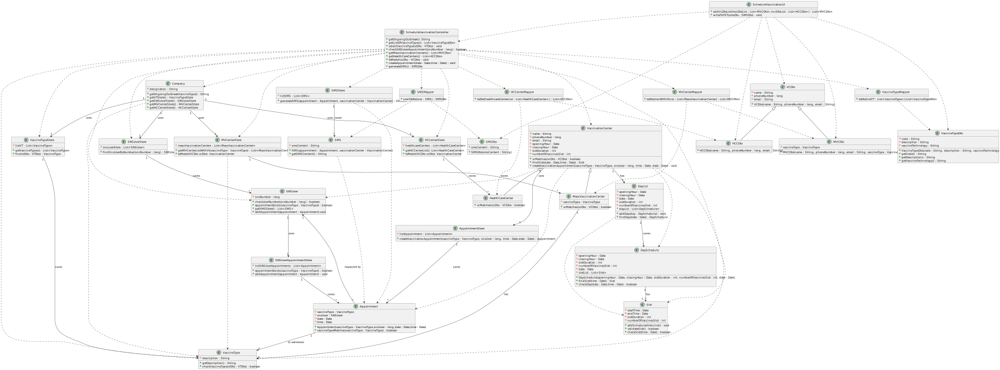

# US 001 - As an SNS user, I intend to use the application to schedule a vaccine 

## 1. Requirements Engineering

### 1.1. User Story Description

As an SNS user, I intend to use the application to schedule a vaccine.

### 1.2. Customer Specifications and Clarifications

**From the specifications document:**

>	To take a vaccine, the SNS user should use the application to schedule his/her vaccination. The user should introduce his/her SNS user number, select the vaccination center, the date, and the time (s)he wants to be vaccinated as well as the type of vaccine to be administered (by default, the system suggests the one related to the ongoing outbreak). Then, the application should check the vaccination center capacity for that day/time and, if possible, confirm that the vaccination is scheduled and inform the user that (s)he should be at the selected vaccination center at the scheduled day and time. The SNS user may also authorize the DGS to send a SMS message with information about the scheduled appointment. If the user authorizes the sending of the SMS, the application should send an SMS message when the vaccination event is scheduled and registered in the system.

**From the client clarifications:**

> **Question:** "The project description says "To take a vaccine, the SNS user should use the application to schedule his/her vaccination. The user should introduce his/her SNS user number, select the vaccination center, the date, and the time(s)he wants to be vaccinated as well as the type of vaccine to be administered [...]".
Does the user have to enter the date and time they want or does the system have to show the available dates and times for the user to select?"
>
> **Answer:** In this sprint the actor should introduce (using the keyboard) the date and time (s)he wants to be vaccinated.

> **Question:** "We are unsure if it's in this user stories that's asked to implement the "send a SMS message with information about the scheduled appointment" found on the Project Description available in moodle. Could you clarify?"
>
> **Answer:** In a previous clarification that I made on this forum, I said: "[The user should receive a] SMS Message to warn of a scheduling [and the message] should include: Date, Time and vaccination center". Teams must record the answers!
A file named SMS.txt should be used to receive/record the SMS messages. We will not use a real word service to send SMSs.

> **Question:** "Regarding the US01 - Should the app ask for the location where the SNS User would like to take his vaccine or should it rather suggest a vaccination center for the SNS User to go, based on the timetable chosen by the SNS User?"
>
> **Answer:** The application should ask for a location where the SNS User wants to take the vaccine.

> **Question:** "I would like to ask if you could tell me if my interpretation of this US was correct.So my interpretation was that the receptionist should choose a vaccination center and than in that vaccination center she would schedule the second dosage of the vaccine"
>
> **Answer:** The goal of this US is to schedule a vaccination for a SNS user. The SNS user should go to a vaccination center and a receptionist should use the application to schedule a vaccination for the SNS user. The receptionist should ask the SNS user for data required to schedule a vaccination. The data needed to schedule a vaccination is the same required in US01. Please check the Project Description available in moodle.

> **Question:** "Regarding US02, i would like to know if a receptionist has the ability to schedule an appointment in different vaccination centres or only on their own."
>
> **Answer:** The receptionist has the ability to schedule the vaccine in any vaccination center. The receptionist should ask the SNS user to indicate/select the preferred vaccination center.

> **Question** "How should we verify that a vaccination center is already registered in the system? Which attribute should the system use to verify this (ex. name, phone number, fax number)?"
>
> **Answer** The name, phone number and e-mail address attributes should be unique.

>[...]as we are in the final stage of Sprint C, we will drop the acceptance criteria b ( The algorithm should check if the SNS User is within the age and time since the last vaccine). This acceptance criteria will be included in Sprint D.

### 1.3. Acceptance Criteria

* **AC1:** At a given moment, the SNS user cannot have more than one vaccine (of a given type) scheduled.
* **AC2:** A file named SMS.txt should be used to receive/record the SMS messages.
* **AC3:** Verify registered Vaccination Centers by using name, phone number and e-mail address attributes.
* **AC4:** The application should ask for a location where the SNS User wants to take the vaccine.

### 1.4. Found out Dependencies

* There is a dependency to "US002 Schedule vaccination for SNS User" since all steps in both USs are similar and therefore code reutilization is necessary.
* There is a dependency to "US009 Create Mass Vaccination Center" since there need to be vaccination centers registered in order to schedule a vaccination.
* There is a dependency to "US010 Create Employee" since there needs to be a receptionist in order to register the vaccination.
* There is a dependency to "US012 SpecifyNewVaccineType" since there needs to exist vaccine types registered in order to register a vaccination.
* There will be a dependency to "US013 SpecifyNewVaccine" since there will be acceptance criteria in the future relating to accepting vaccination requests according to age and dose number.
* There will be a dependency to "US14 Load a set of users from a CSV file" since the user needs to be saved in the system in order to request a vaccination appointment.

### 1.5 Input and Output Data

**Input Data:**

* Typed data:
    * a sns User number,
    * a time of Vaccination,
    * a date of Vaccination
    * a permission to receive SMS

* Selected data:
    * a vaccine type
    * a vaccination center

**Output Data:**

* a vaccine type for the current outbreak
* List of available vaccine types
* List of available vaccination centers
* (In)Success of the operation
* Selected vaccination center, the scheduled day and time

### 1.6. System Sequence Diagram (SSD)

### 1.7 Other Relevant Remarks

* n/a

## 2. OO Analysis

### 2.1. Relevant Domain Model Excerpt 

### 2.2. Other Remarks

n/a

## 3. Design - User Story Realization 

### 3.1. Rationale

**SSD - Alternative 1 is adopted.**

| Interaction ID | Question: Which class is responsible for...                                       | Answer                                 | Justification (with patterns)                                                                                                                                  |
|:---------------|:----------------------------------------------------------------------------------|:---------------------------------------|:---------------------------------------------------------------------------------------------------------------------------------------------------------------|
| Step 1         | ... interacting with the actor?                                                   | ScheduleVaccinationUI                  | Pure Fabrication: there is no reason to assign this responsibility to any existing class in the Domain Model                                                   |
|                | ... coordinating the US?                                                          | ScheduleVaccinationController          | Controller: Represents a use case scenario (ScheduleVaccination)                                                                                               |
| Step 2         | ... knowing the ongoing outbreak vaccine type?                                    | Company                                | IE: knows ongoing outbreak                                                                                                                                     |
|                | ... knowing the ongoing outbreak description?                                     | VaccineType                            | IE: knows its own data                                                                                                                                         |
| Step 3         | ... knowing the list of existing vaccine types?                                   | Company                                | IE: knows list of own vaccine types                                                                                                                            |
|                | ... knowing all the existing vaccine types?                                       | VaccineTypeStore                       | Pure Fabrication: Company delegates responsability to store and perform operations in vaccine types supporting high cohesion                                   |
|                | ... creating the list to show?                                                    | VaccineTypeMapper                      | Pure Fabrication: non Domain class responsible for materializing VaccineTypeDto objects for use in the UI                                                      |
|                | ... storing vaccine type information for UI usage?                                | VaccineTypeDto                         | DTO: holds VaccineType data required for printing in UI                                                                                                        |
| Step 4         | ... showing the list of vaccine types?                                            | ScheduleVaccinationUI                  | UI is responsible for the interaction with the actor                                                                                                           |
| Step 5         | ... temporarily saving selected vaccine type?                                     | ScheduleVaccinationController          | Controller: Responsible for enabling and handling the flow of operations necessary for the completion of the US                                                |
|                | ... knowing all the existing vaccine types?                                       | VaccineTypeStore                       | Pure Fabrication/IE: responsible for storing existing vaccine types                                                                                            |
|                | ... knowing the information of each vaccine type?                                 | VaccineType                            | IE: knows its own data                                                                                                                                         |
| Step 6         | ... asking user for data?                                                         | ScheduleVaccinationUI                  | UI is responsible for the interaction with the actor                                                                                                           |
| Step 7         | ... temporarily saving relevant SNS User?                                         | ScheduleVaccinationController          | Controller: Responsible for enabling and handling the flow of operations necessary for the completion of the US                                                |
|                | ... knowing the list of registered SNS Users?                                     | Company                                | IE: knows list of its own SNS Users                                                                                                                            |
|                | ... knowing all the registered SNS Users?                                         | SNSUserStore                           | Pure Fabrication: Company delegates responsability to store and perform operations in SNS Users supporting high cohesion                                       |
|                | ... knowing SNS number of the SNS User?                                           | SNSUser                                | IE: knows its own data                                                                                                                                         |
|                | ... knowing the list of its own Appointments?                                     | SNSUser                                | IE: knows list of own appointments                                                                                                                             |
|                | ... knowing all the registered SNS User's Appointments?                           | SNSUserAppointmentStore                | Pure Fabrication: SNS User delegates responsability to store and perform operations in own Appointments supporting high cohesion                               |
|                | ... knowing the vaccine type of an appointment?                                   | Appointment                            | IE: knows its own data                                                                                                                                         |
|                | ... knowing the list of mass vaccination centers?                                 | Company                                | IE: knows list of own mass vaccination centers                                                                                                                 |
|                | ... knowing all the registered mass vaccination centers?                          | MVCenterStore                          | Pure Fabrication: Company delegates responsability to store and perform operations in mass vaccination centers supporting high cohesion                        |
|                | ... knowing the vaccine type associated with a mass vaccination centers?          | MassVaccinationCenter                  | IE: knows its own data                                                                                                                                         |
|                | ... creating the list to show?                                                    | MVCenterMapper                         | Pure Fabrication: non Domain class responsible for materializing MVCDto objects for use in the UI                                                              |
|                | ... knowing the name, phone number and emailAddress of a mass vaccination center? | MassVaccinationCenter                  | IE: knows its own data                                                                                                                                         |
|                | ... storing mass vaccination center information for UI usage?                     | MVCDto                                 | DTO: holds the relevant data required for printing in UI                                                                                                       |
|                | ... knowing the list of healthcare centers?                                       | Company                                | IE: knows list of own healthcare centers                                                                                                                       |
|                | ... knowing all the registered healthcare centers?                                | HCCenterStore                          | Pure Fabrication: Company delegates responsability to store and perform operations in healthcare centers supporting high cohesion                              |
|                | ... creating the list to show?                                                    | HCCenterMapper                         | Pure Fabrication: non Domain class responsible for materializing DTO objects for use in the UI                                                                 |
|                | ... knowing the name, phone number and emailAddress of a healthcare center?       | HealthcareCenter                       | IE: knows its own data                                                                                                                                         |
|                | ... storing healthcare center information for UI usage?                           | HCCDto                                 | DTO: holds the relevant data required for printing in UI                                                                                                       |
|                | ... joining both DTO lists to show the User?                                      | ScheduleVaccinationUI                  | UI is responsible for handling information presenntation operations                                                                                            |
| Step 8         | ... showing the list of available vaccination centers?                            | ScheduleVaccinationUI                  | UI is responsible for the interaction with the actor                                                                                                           |
| Step 9         | ... temporarily saving selected vaccine type?                                     | ScheduleVaccinationController          | Controller: Responsible for enabling and handling the flow of operations necessary for the completion of the US                                                |
|                | ... knowing all the registered healthcare centers?                                | HCCenterStore/MVCenterStore            | Pure Fabrication: Company delegates responsability to store and perform operations in vaccination centers supporting high cohesion                             |
|                | ... finding the vaccination center for which the DTO information matches?         | VaccinationCenter                      | IE: knows its own data                                                                                                                                         |
|                | ... determining what type of vaccination center is supposed to be saved?          | MassVaccinationCenter/HealthcareCenter | Polymorphism: the center is found by using the method in VaccinationCenter and being redirected according to the type of subclass (type of vaccination center) |
| Step 10        | ... asking user for data?                                                         | ScheduleVaccinationUI                  | UI is responsible for the interaction with the actor                                                                                                           |
| Step 11        | ... temporarily saving relevant appointment?                                      | ScheduleVaccinationController          | Controller: Responsible for enabling and handling the flow of operations necessary for the completion of the US                                                |
|                | ... knowing the list of existing days?                                            | VaccinationCenter                      | IE: knows list of its own registered Days                                                                                                                      |
|                | ... knowing all the registered days?                                              | DayList                                | Pure Fabrication: VaccinationCenter delegates responsability to store and perform operations in Days supporting high cohesion                                  |
|                | ... knowing the date of a day?                                                    | DaySchedule                            | IE: knows its own data                                                                                                                                         |
|                | ... creating and saving a new day?                                                | DayList                                | Creator: Has initializing data of Day and records instances of Day.                                                                                            |
|                | ... knowing the list of slots in a day?                                           | DaySchedule                            | IE: knows list of its own existing slots                                                                                                                       |
|                | ... knowing the time interval of a slot?                                          | Slot                                   | IE: knows its own data                                                                                                                                         |
|                | ... knowing if there's vacancy in a slot?                                         | Slot                                   | IE: knows its own data                                                                                                                                         |
|                | ... knowing the list of appointments?                                             | VaccinationCenter                      | IE: knows list of its own existing appointments                                                                                                                |
|                | ... knowing all the registered appointments in a vaccination center?              | AppointmentStore                       | Pure Fabrication: VaccinationCenter delegates responsability to store and perform operations in Appointments supporting high cohesion                          |
|                | ... creating and saving a new appointment?                                        | AppointmentStore                       | Creator: Has initializing data of Appointment and records instances of Appointment                                                                             |
|                | ... knowing the list of appointments associated with a SNS User?                  | SNSUser                                | IE: knows list of its own appointments                                                                                                                         |
|                | ... knowing all the sheculed appointments associated with a SNS User?             | SNSUserAppointmentStore                | Pure Fabrication: SNSUser delegates responsability to store and perform operations in Appointments supporting high cohesion                                    |
|                | ... saving a reference to a newly created appointment associated with a SNS User? | SNSUserAppointmentStore                | Pure Fabrication: SNSUser delegates responsability to store and perform operations in Appointments supporting high cohesion                                    |
|                | ... changingvacancy in a slot?                                                    | Slot                                   | IE: knows its own data                                                                                                                                         |
| Step 12        | ... asking user for data?                                                         | ScheduleVaccinationUI                  | UI is responsible for the interaction with the actor                                                                                                           |
| Step 13        | ... temporarily saving SMS DTO to show the SNS User?                              | ScheduleVaccinationUI                  | UI is responsible for the interaction with the actor                                                                                                           |
|                | ... knowing the list of SMS associated with a SNS User?                           | SNSUser                                | IE: knows list of associated SMS                                                                                                                               |
|                | ... knowing all the SMS associated with a SNS User?                               | SMSStore                               | Pure Fabrication: SNSUser delegates responsability to store and perform operations in SMS supporting high cohesion                                             |
|                | ... creating and saving a new SMS?                                                | SMSStore                               | Creator: Receives initializing data of SMS and records instances of SMS                                                                                        |
|                | ... knowing the content of a SMS?                                                 | SMS                                    | IE: knows its own data                                                                                                                                         |
|                | ... getting the content of a SMS and storing it in a DTO for use in the UI?       | SMSMapper                              | Pure Fabrication: non Domain class responsible for materializing SMSDto objects for use in the UI                                                              |
|                | ... storing content of SMS for UI usage?                                          | SMSDto                                 | DTO: holds SMS data relevant for printing and use in UI                                                                                                        |
|                | ... saving information of SMS DTO in the system (file)?                           | ScheduleVaccinationUI                  | UI is responsible for output operations                                                                                                                        |
| Step 14        | ... informing of operation success?                                               | ScheduleVaccinationUI                  | UI is responsible for the interaction with the actor                                                                                                           |
|                | ... showing selected vaccination center, day and time information on the screen?  | ScheduleVaccinationUI                  | UI is responsible for the interaction with the actor                                                                                                           |

### Systematization ##

According to the taken rationale, the conceptual classes promoted to software classes are:

* Company
* VaccineType
* SNSUser
* Appointment
* MassVaccinationCenter
* HealthcareCenter
* VaccinationCenter
* DaySchedule
* Slot
* SMS

Other software classes (i.e. Pure Fabrication) identified:

* ScheduleVaccinationUI
* ScheduleVaccinationController
* VaccineTypeStore
* VaccineTypeMapper
* VaccineTypeDto
* SNSUserStore
* SNSUserAppointmentStore
* MVCenterStore
* MVCenterMapper
* MVCDto
* HCCenterStore
* HCCenterMapper
* HCCDto
* DayList
* AppointmentStore
* SMSStore
* SMSMapper
* SMSDto

## 3.2. Sequence Diagram (SD)

**US001_SD**

**US001_SD_vtMapper_ToDto**

**US001_SD_mvcMapper_ToDto**

**US001_SD_hccMapper_ToDto**

**US001_SD_appointmentMapper_appointmentDTO**

## 3.3. Class Diagram (CD)

# 4. Tests

	@Test
    void testToDto() {
        SNSUserDTO result = SNSUserMapper.toDto(new SNSUser("name", "address", "sex", 0L, "email", new GregorianCalendar(2022, Calendar.MAY, 29, 22, 26).getTime(), 0L, 0L));
        Assertions.assertEquals(new SNSUserDTO("name", "address", "sex", 0L, "email", new GregorianCalendar(2022, Calendar.MAY, 29, 22, 26).getTime(), 0L, 0L), result);
    }
# 5. Construction (Implementation)

## Class ScheduleVaccinationController 

    public class ScheduleVaccinationController {
        private Company company;
        private SNSUser snsUser;
        private  VaccinationCenter vaccinationCenter;

      public void setOngoingVaccineType() {
        this.vaccineType = company.getOngoingOutbreakVaccineType();
      }

        private VaccineType vaccineType;

        private Appointment appointment;

        private List<MassVaccinationCenter>mvcWithVtList;

      public ScheduleVaccinationController() {
        this.company = App.getInstance().getCompany();
      }
      public String getOngoingOutbreak(){
        VaccineType outbreakVaccineType=company.getOngoingOutbreakVaccineType();
        String outbreak=outbreakVaccineType.getDescription();
        return outbreak;
      }
      public List<VaccineTypeDto> getListOfVaccineTypes(){
        VaccineTypeStore vtStore= company.getVTStore();
        List<VaccineType> listVT= vtStore.getVaccineTypes();
        List<VaccineTypeDto> listVTDto=VaccineTypeMapper.toDto(listVT);

        return listVTDto;
      }
      public void selectVaccineType(VaccineTypeDto vtDto) throws Exception {
        VaccineTypeStore vtStore= company.getVTStore();
        this.vaccineType=vtStore.find(vtDto);
     }
      public boolean checkSnsUserAppointment(long snsNumber) throws Exception {
        SNSUserStore snsUserStore= company.getSnsUserStore();
        this.snsUser= snsUserStore.findSnsUserByNumber(snsNumber);
        return this.snsUser.appointmentExists(vaccineType);
      }
    
      public List<MVCDto> getMassVaccinationCenters(){
        MVCenterStore mvcStore = company.getMVCenterStore();
        this.mvcWithVtList = mvcStore.getMVCenterListWithVt(vaccineType);
        return MVCenterMapper.toDto(mvcWithVtList);
      }
    
     public List<HCCDto> getHealthcareCenters(){
        HCCenterStore hccStore = company.getHCCenterStore();
        List<HealthCareCenter> hccList = hccStore.getHCCenterList();
        return HCCenterMapper.toDto(hccList);
      }
      public void toModel(VCDto vcDto) throws Exception {
        if(vcDto instanceof HCCDto){
            HCCenterStore hcCenterStore= company.getHCCenterStore();
            this.vaccinationCenter=hcCenterStore.toModel(vcDto);

        }
        else{
            MVCenterStore mvCenterStore= company.getMVCenterStore();
            this.vaccinationCenter= mvCenterStore.toModel(vcDto);

        }
      }
    
      public boolean createAppointment(Date date, Date time) throws Exception {
        Slot sl=vaccinationCenter.findSlot(date,time);
        if(sl.validateSlot()){
            this.appointment=vaccinationCenter.createVaccinationAppointment(vaccineType,snsUser,date,time);
            snsUser.addAppointment(appointment);
            sl.addScheduledVaccine();
            return true;
        } else{
            return false;
        }
      }
      public SMSDto generateSMS(){
        SMSStore smsStore=snsUser.getSMSStore();
        SMS sms=smsStore.generateSMS(appointment,vaccinationCenter);
        SMSDto generatedSMS= SMSMapper.smsToDto(sms);

        return generatedSMS;
      }

    }

## Class Company

		public class Company {

    private String designation;

    private AuthFacade authFacade;
    
    private MVCenterStore mvCenterStore;
    

    private VaccineTypeStore vaccineTypeStore;
   
    private SNSUserStore snsUserStore;
   
    private HCCenterStore hcCenterStore;
    
    private  VaccineType ongoingOutbreak;

    private static RoleStore roleStore;
    
    private static EmployeeStore empStore;

    public Company(String designation) {
        if (StringUtils.isBlank(designation))
            throw new IllegalArgumentException("Designation cannot be blank.");

        this.designation = designation;
        this.authFacade = new AuthFacade();
        this.mvCenterStore =new MVCenterStore();
        this.vaccineTypeStore=new VaccineTypeStore();
        this.roleStore=new RoleStore();
        this.empStore=new EmployeeStore();
        this.snsUserStore=new SNSUserStore();
        this.hcCenterStore=new HCCenterStore();
    }
    public String getDesignation() {
        return designation;
    }
    public AuthFacade getAuthFacade() {
        return authFacade;
    }
    public MVCenterStore getMVCenterStore(){
        return mvCenterStore;
    }
    public VaccineTypeStore getVTStore(){
        return vaccineTypeStore;
    }
    public static RoleStore getRoleStore(){
        return roleStore;
    }
    public static EmployeeStore getEmployeeStore(){
        return empStore;
    }
    public SNSUserStore getSnsUserStore(){
        return snsUserStore;
    }

    public HCCenterStore getHCCenterStore() {
        return hcCenterStore;
    }
    public Vaccine createVaccine(VaccineDto vaccineDto, VaccineType vt) {
        return vaccineTypeStore.createVaccine(vaccineDto, vt);
    }
    public boolean validateVaccine(Vaccine vaccine, VaccineType selectedVt) {
        return vaccineTypeStore.validateVaccine(vaccine, selectedVt);
    }
    public void saveVaccine(Vaccine vaccine, VaccineType vt) {
        vaccineTypeStore.saveVaccine(vaccine, vt);
    }
    public List<Role> getRoles() {
        return this.roleStore.getListOfRole();
    }
    @Override
    public boolean equals(Object o) {
        if (this == o) return true;
        if (!(o instanceof Company)) return false;

        Company company = (Company) o;

        if (!Objects.equals(designation, company.designation)) return false;
        if (!Objects.equals(authFacade, company.authFacade)) return false;
        if (!Objects.equals(mvCenterStore, company.mvCenterStore))
            return false;
        if (!Objects.equals(vaccineTypeStore, company.vaccineTypeStore))
            return false;
        if (!Objects.equals(roleStore, company.roleStore)) return false;
        return Objects.equals(empStore, company.empStore);
    }
    public VaccineType getOngoingOutbreakVaccineType(){
        return this.ongoingOutbreak;
    }
    public void setOngoingOutbreakVaccineType(VaccineType vaccineType){
          ongoingOutbreak=vaccineType;
    }

    }

# 6. Integration and Demo 

* n/a

# 7. Observations

n/a

