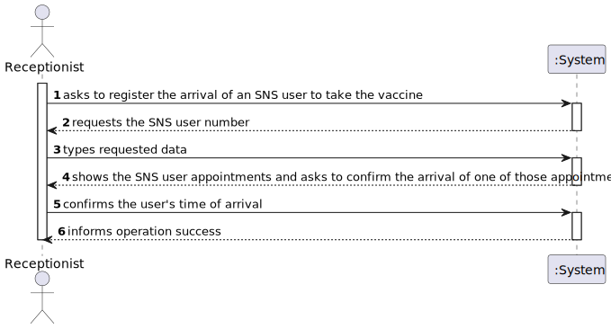
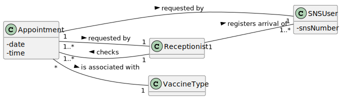
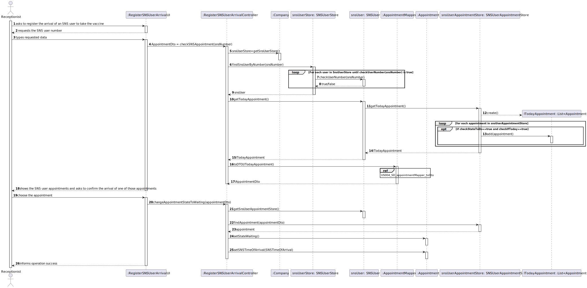
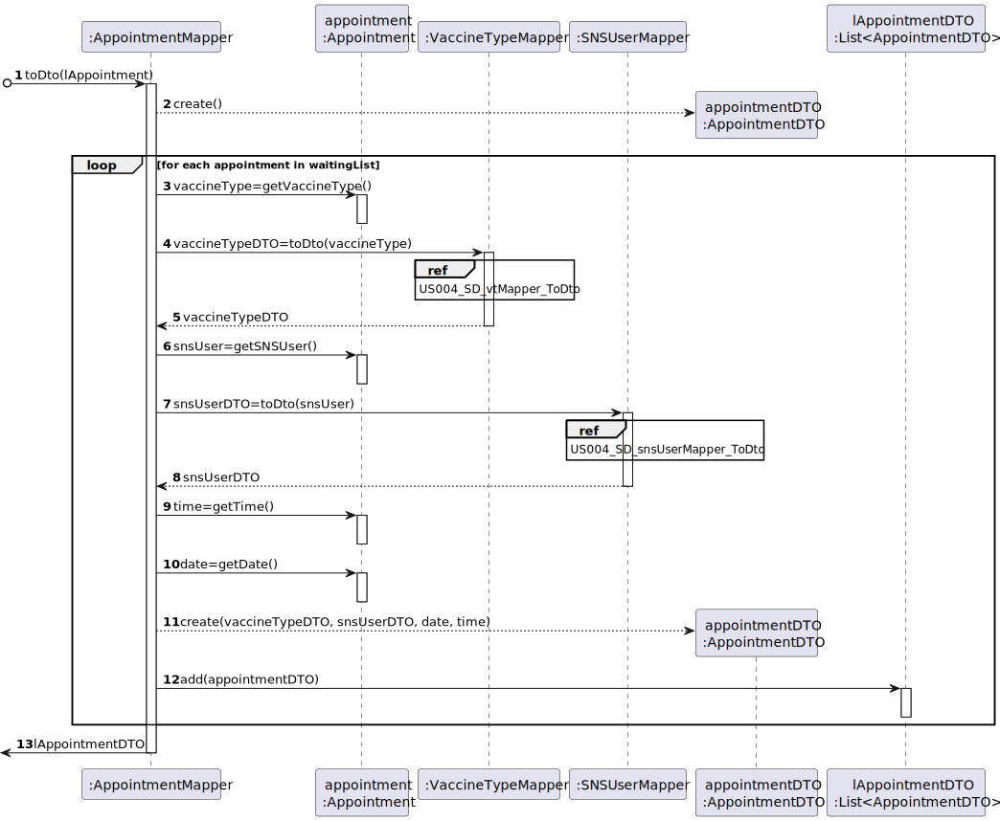
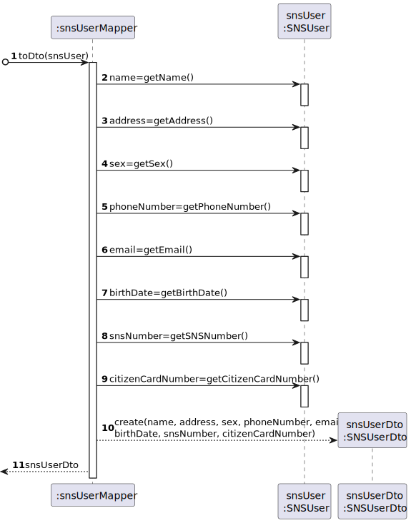
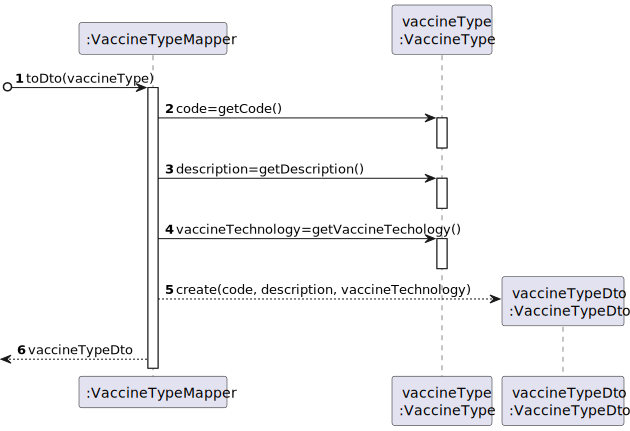
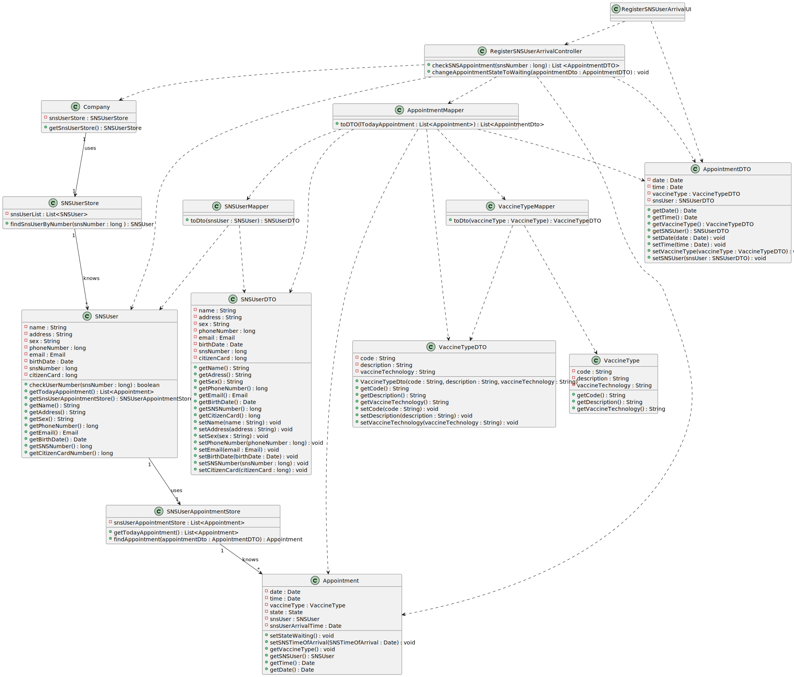

# US 004 - Register The Arrival Of A SNS User

## 1. Requirements Engineering

### 1.1. User Story Description

As a receptionist at a vaccination center, I want to register the arrival of a SNS user
to take the vaccine.

### 1.2. Customer Specifications and Clarifications 

**From the specifications document:**

>	When the SNS user arrives at the vaccination center, a receptionist registers the arrival of the user to
take the respective vaccine. The receptionist asks the SNS user for his/her SNS user number and
confirms that he/she has the vaccine scheduled for the that day and time.

>	 If the information is
correct, the receptionist acknowledges the system that the user is ready to take the vaccine.

**From the client clarifications:**

>	**Question:** "Regarding US04, what are the attributes needed in order to register the arrival of a SNS user to a vaccination center".
>
>	**Answer:** The time of arrival should be registered.

>	**Question:** "Regarding US04, a receptionist register the arrival of a SNS user immediately when he arrives at the vaccination center or only after the receptionist confirms that the respective user has a vaccine schedule for that day and time."
>
>	**Answer:** The receptionist registers the arrival of a SNS user only after confirming that the user has a vaccine scheduled for that day and time.

>	**Question:** "When the SNS user number is introduce by the receptionist and the system has no appointment for that SNS user number, how should the system proceed?"
>
>	**Answer:** The application should present a message saying that the SNS user did not scheduled a vaccination.

>	**Question:** "Regarding US04, i would like to know what's the capacity of the waiting room."
>
>	**Answer:** The waiting room will not be registered or defined in the system. The waiting room of each vaccination center has the capacity to receive all users who take the vaccine on given slot.

### 1.3. Acceptance Criteria

* **AC1:** No duplicate entries should be possible for the same SNS
  user on the same day or vaccine period.
* **AC2:** The waiting room will not be registered or defined in the system.
* **AC3:** The waiting room of each vaccination center has the capacity to receive all users who take the vaccine on given slot.
* **AC4:** The receptionist can work in any center.

### 1.4. Found out Dependencies

* There is a dependency to "US01 - Schedule a vaccine (SNS User)" since at least an SNS User needs to schedule a vaccine to be selectable to the Arrival List.
* There is a dependency to "US02 - Schedule a vaccine (Receptionist)" since at least an SNS User needs to schedule a vaccine to be selectable to the Arrival List.

### 1.5 Input and Output Data

**Input Data:**

* Typed data:
	* SNS user ID
	
* Selected data:
	* One of the SNS User appointments for that day  

**Output Data:**

* List of the SNS User appointments for that day 
### 1.6. System Sequence Diagram (SSD)

**Other alternatives might exist.**

### 1.7 Other Relevant Remarks

* The created task stays in a "not published" state in order to distinguish from "published" tasks.

## 2. OO Analysis

### 2.1. Relevant Domain Model Excerpt 

### 2.2. Other Remarks

n/a

## 3. Design - User Story Realization 

### 3.1. Rationale

| Interaction ID | Question: Which class is responsible for...                                         | Answer                           | Justification (with patterns)                                                                                            |
|:---------------|:------------------------------------------------------------------------------------|:---------------------------------|:-------------------------------------------------------------------------------------------------------------------------|
| Step 1         | ... interacting with the actor?                                                     | RegisterSNSUserArrivalUI         | Pure Fabrication: UI is responsible for the interaction with the actor                                                   |
|                | ... coordinating the US?                                                            | RegisterSNSUserArrivalController | Controller: Represents a use case scenario (RegisterSNSUserArrival)                                                      |
| Step 2         | n/a                                                                                 |                                  |                                                                                                                          |
| Step 3         | ... knowing the list of registered appointments?                                    | SNSUser                          | IE: knows list of its own appointments                                                                                   |
|                | ... knowing upcoming appointments for that day that are relative to that user?      | SNSUserAppointmentStore          | IE: has registered all SNS User appointments                                                                             | 
|                | ... knowing the list of registered SNS Users?                                       | Company                          | IE: knows list of its own SNS Users                                                                                      |
|                | ... knowing all the registered SNS Users?                                           | SNSUserStore                     | Pure Fabrication: Company delegates responsability to store and perform operations in SNS Users supporting high cohesion |
|                | ... knowing SNS number of the SNS User?                                             | SNSUser                          | IE: knows its own data                                                                                                   |
|                | ... creating the list to show?                                                      | AppointmentMapper                | Pure Fabrication: non Domain class responsible for materializing AppointmentDto objects for use in the UI                |
|                | ... storing appointment information for UI usage?                                   | AppointmentDTO                   | DTO: holds Appointment data required for printing in UI                                                                  |
| Step 4         | ... showing the list of existing appointments for that day?                         | RegisterSNSUserArrivalUI         | Pure Fabrication: UI is responsible for the interaction with the actor                                                   |
| Step 5         | ... knowing the corresponding appointment from the appointmentDto?                  | SNSUserAppointmentStore          | IE: has registered all SNS User appointments                                                                             |
|                | ... knowing the state of the appointment?                                           | Appointment                      | IE: knows its own data                                                                                                   |
|                | ... changing the state of the appointment?                                          | Appointment                      | IE: knows its own data                                                                                                   |
|                | ... storing the time of arrival of the SNS user?                                    | Appointment                      | IE: knows all data about the appointment of the SNS User                                                                 |
| Step 6         | ... informing the success of the operation?                                         | RegisterSNSUserArrivalUI         | Pure Fabrication: UI is responsible for the interaction with the actor                                                   |

### Systematization ##

According to the taken rationale, the conceptual classes promoted to software classes are: 

 * Company
 * Appointment
 * SNSUser

Other software classes (i.e. Pure Fabrication) identified: 

 * RegisterSNSUserArrivalUI  
 * RegisterSNSUserArrivalController
 * SNSUserAppointmentStore
 * SNSUserStore
 * AppointmentMapper
 * AppointmentDTO

## 3.2. Sequence Diagram (SD)

*US004_SD_appointmentMapper_toDto*

*US004_SD_snsUserMapper_ToDto*

*US004_SD_vtMapper_ToDto*

## 3.3. Class Diagram (CD)

# 4. Tests 

**Test 1:** Check that the method GetRoles is working correctly.

	@Test
    void testGetRoles() {
        List<Role> roleList = new ArrayList<>(List.of(new Role[]{new Role("Nurse", Constants.ROLE_NURSE), new Role("Receptionist", Constants.ROLE_RECEPTIONIST), new Role("Center Coordinator", Constants.ROLE_CENTER_COORDINATOR)}));
        List<Role> roleList1 = new ArrayList<>(List.of(new Role[]{new Role("Nurse", Constants.ROLE_NURSE), new Role("Receptionist", Constants.ROLE_RECEPTIONIST)}));

        Assertions.assertEquals(company.getRoles(), roleList);
        Assertions.assertNotEquals(company.getRoles(), roleList1);
    }
	

**Test 2:** Check that the method CheckIfToday is working correctly.

    @Test
    void testCheckIfToday() {
        Appointment appointment = new Appointment(new VaccineType("code", "description", "vaccineTechnology"), new SNSUser("name", "adress", "sex", 919191919, "email@email.com", new Date(), 123456789, 123456789), new Date(), new Date());
        Appointment appointment1 = new Appointment(new VaccineType("code", "description", "vaccineTechnology"), new SNSUser("name", "adress", "sex", 919191919, "email@email.com", new Date(), 123456789, 123456789), new Date(2021, 1, 1), new Date());
        Assertions.assertTrue(appointment.checkIfToday());
        Assertions.assertFalse(appointment1.checkIfToday());
    }

*It is also recommended to organize this content by subsections.* 

# 5. Construction (Implementation)

## Class RegisterSNSUserArrivalController 

		

## Class Organization

		public Task createTask(String ref, String designation, String informalDesc, 
			String technicalDesc, Integer duration, Double cost, Category cat)() {
		
	
			Task task = new Task(ref, designation, informalDesc, technicalDesc, duration, cost, cat);
			if (this.validateTask(task))
				return task;
			return null;
		}

# 6. Integration and Demo
* A new option on the Receptionist menu options was added.

# 7. Observations

n/a

