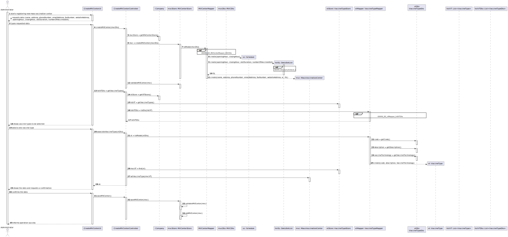

# US 009 - Create Mass Vaccination Center

## 1. Requirements Engineering

### 1.1. User Story Description

*As an administrator, I want to register a vaccination center to respond to a certain pandemic.*

### 1.2. Customer Specifications and Clarifications 

**From the Specifications Document:** 

>"Different from the health care centers, which
provide a wide range of healthcare services to citizens in a certain area, the community mass
vaccination centers are facilities specifically created to administer vaccines of a single type as
response to an ongoing disease outbreak (e.g.: Covid-19)."

>"The main difference between the two kinds of centers is
that a healthcare center is associated with a given ARS (Administração Regional de Saúde) and
AGES (Agrupamentos de Centros de Saúde), and it can administer any type of vaccines (e.g.:
Covid-19, Dengue, Tetanus, smallpox)."

>"Both kinds of vaccination centers are characterized by a name, an address, a phone number, an e-mail address, a
fax number, a website address, opening and closing hours, slot duration (e.g.: 5 minutes) and the
maximum number of vaccines that can be given per slot (e.g.: 10 vaccines per slot)."

**From the client clarification:**

*n/a*

### 1.3. Acceptance Criteria

*n/a*

### 1.4. Found out Dependencies

*Dependent on US012 - SpecifyNewVaccineType*

### 1.5 Input and Output Data

**Input Data:**

* Typed data:
    * a name
    * an address
    * a phone number
    * an email address
    * a fax number
    * a website address
    * an opening hour
    * a closing hour
    * slot duration (in minutes)
    * the number of vaccines administered per slot

* Selected Data:
  * a vaccine type

**Output Data:**

* (In)Success of the operation

### 1.6. System Sequence Diagram (SSD)

### 1.7 Other Relevant Remarks

*n/a*

## 2. OO Analysis

### 2.1. Relevant Domain Model Excerpt 

### 2.2. Other Remarks

*n/a*

## 3. Design - User Story Realization 

### 3.1. Rationale

**The rationale grounds on the SSD interactions and the identified input/output data.**

| Interaction ID | Question: Which class is responsible for...      | Answer                                 | Justification (with patterns)                       |
|:---------------|:-------------------------------------------------|:---------------------------------------|:----------------------------------------------------|
| Step 1  		     | ... instantiating a new Mass Vaccination Center? | Company                                | Creator: R1/2                                       |
| Step 2  		     | n/a                                              |                                        |                                                     |
| Step 3  		     | ... saving the input data?                       | MassVaccinationCenter (Slot, Schedule) | IE: The object created in step 1 knows its own data |
| Step 4  		     | ... knowing vaccine types?                       | Company                                | IE: stores created VaccineType objects              |
| 		             | ... showing vaccine types to be selected?        | UI                                     | IE: responsible for user interaction                |
| Step 5         | ... knowing vaccine type data?                   | VaccineType                            | IE: the object knows its own data                   |
|                | ... saving selected vaccine type?                | MassVaccinationCenter                  | IE: records the associated VaccineType object       |
| Step 6  		     | ... validating the data locally?                 | MassVaccinationCenter                  | IE: knows its own data                              |
| 	              | ... validating the data globally?                | Company                                | IE: knows all the MassVaccinationCenter objects     |
| Step 7  		     | ... saving the created Mass Vaccination Center?  | Company                                | IE: records all the MassVaccinationCenter objects   |
| Step 8  		     | ... informing of operation success?              | UI                                     | IE: responsible for user interaction                |

### Systematization ##

According to the taken rationale, the conceptual classes promoted to software classes are: 

 * Company
 * MassVaccinationCenter 
 * Schedule
 * Slot
 * VaccineType

Other software classes (i.e. Pure Fabrication) identified: 
 * CreateMVCenterUI
 * CreateMVCenterController
 * MVCenterStore
 * MVCenterMapper
 * VaccineTypeStore
 * VaccineTypeMapper
 * DailySlotList
 * VaccineTypeDto
 * MVCDto

## 3.2. Sequence Diagram (SD)
*US009_SD*

*US009_SD_DailySlotList_sl*

*US009_SD_MVCenterMapper_MVCDto*

*US009_SD_vtMapper_listVTDto*

## 3.3. Class Diagram (CD)

# 4. Tests 

*None developed to date.*

# 5. Construction (Implementation)

## Class CreateMVCenterController

    public class CreateMVCenterController {

    private Company company;
    private MVCenterStore mvcStore;
    private MassVaccinationCenter mvc;
    private VaccineTypeStore vtStore;

    private List<VaccineType> listVT;
    private List<VaccineTypeDto> listVTDto;
    private VaccineType vt;

    public CreateMVCenterController(){
        this(App.getInstance().getCompany());
        this.mvcStore = this.company.getMVCenterStore();
        this.vtStore = this.company.getVTStore();
    }

    public CreateMVCenterController(Company company){
        this.company = company;
    }

    public boolean checkIfVacCenterStoreNull(){
        return mvcStore.checkIfNull();
    }

    public void printVacCenterStore(){mvcStore.printVaccinationStore();}

    public void printVaccineTypeStore(){
        vtStore.printVaccineTypeStore();}

    public VaccineType getVaccineType(int index){
        return vtStore.getVaccineType(index);
    }

    public MassVaccinationCenter createMVCenter(MVCDto mvcDto){
        MassVaccinationCenter mvc = mvcStore.createMVCenter(mvcDto);
        this.mvc=mvc;
        return mvc;
    };
    public List<VaccineTypeDto> getVaccineTypes(){
        this.listVT = vtStore.getVaccineTypes();
        this.listVTDto = VaccineTypeMapper.toDto(listVT);
        return listVTDto;
    };
    public void associateVaccineType(VaccineTypeDto vtDto){
        this.vt = VaccineTypeMapper.toModel(vtDto);
        VaccineType mvcVT = VaccineTypeStore.find(vt);
        this.mvc.setVaccineType(mvcVT);
    };
    public void saveMVCenter(){
        mvcStore.saveMVCenter(mvc);
    };

## Class Company

    public class Company {

    private String designation;
    private AuthFacade authFacade;
    private MVCenterStore vaccinationCenterStore;
    private VaccineTypeStore vaccineTypeStore;
    private RoleStore roleStore;
    private EmployeeStore employeeStore;

    public Company(String designation)
    {
        if (StringUtils.isBlank(designation))
            throw new IllegalArgumentException("Designation cannot be blank.");

        this.designation = designation;
        this.authFacade = new AuthFacade();
        this.vaccinationCenterStore=new MVCenterStore();
        this.vaccineTypeStore=new VaccineTypeStore();
        this.roleStore=new RoleStore();
        this.employeeStore=new EmployeeStore();
    }

    public String getDesignation() {
        return designation;
    }

    public AuthFacade getAuthFacade() {
        return authFacade;
    }

    public MVCenterStore getMVCenterStore(){
        return vaccinationCenterStore;
    }

    public VaccineTypeStore getVTStore(){
        return vaccineTypeStore;
    }
    public RoleStore getRoleStore(){
        return roleStore;
    }
    public EmployeeStore getEmployeeStore(){
        return employeeStore;
    }

# 6. Integration and Demo 

*There was care taken with using the same classes as related US and reusing methods used in other US.*

# 7. Observations

*None to date*

