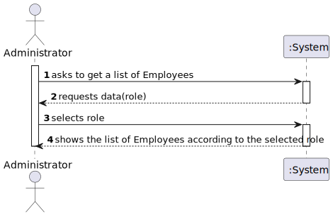
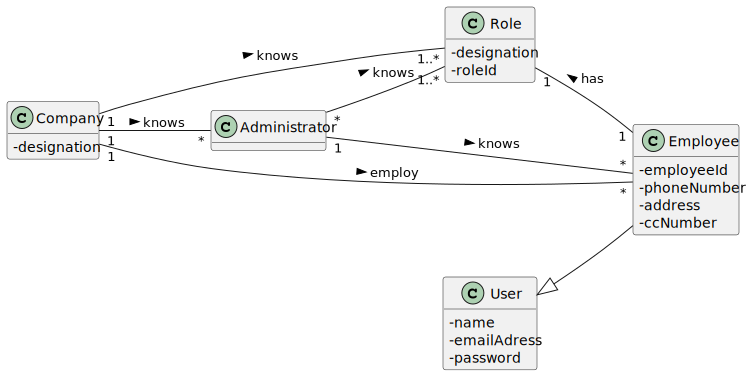
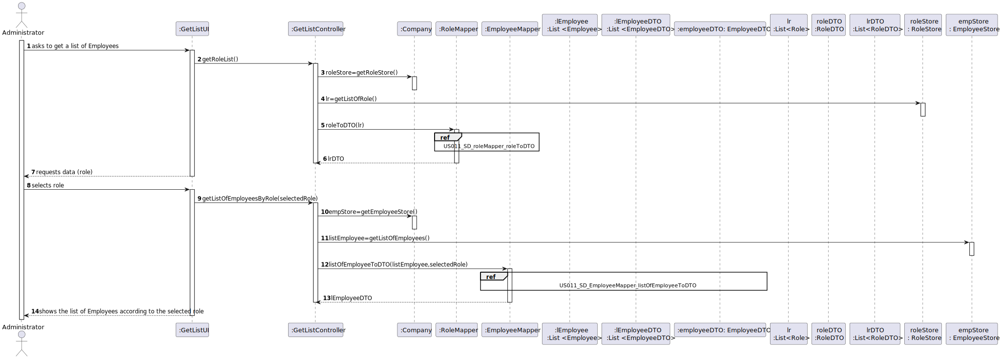
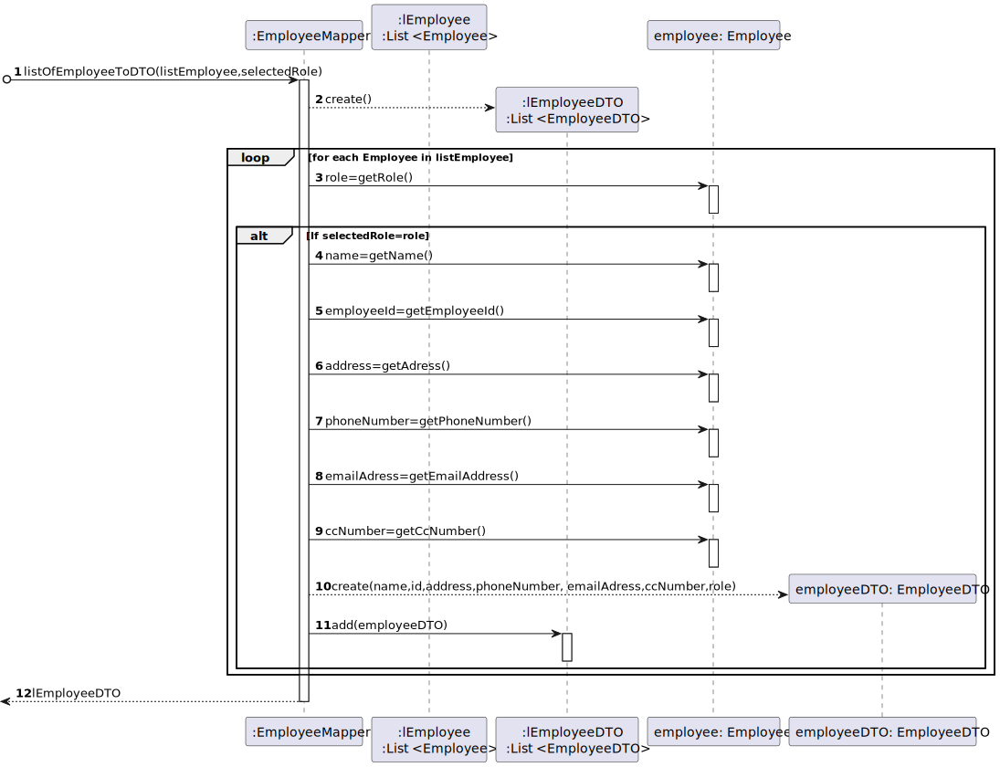
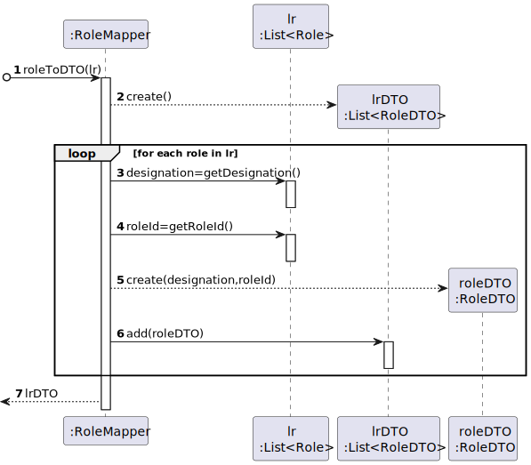
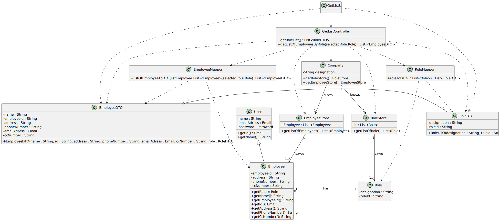

# US 011 - Get List of Employees of a Given Role

## 1. Requirements Engineering

### 1.1. User Story Description

*As an administrator, I want to get a list of Employees with a given function/role.*

### 1.2. Customer Specifications and Clarifications
>The administrator should select a given role and all employees associated with the selected role should be listed.

>At the moment, the list does not have any order of presentation to be considered.

> The application should present all Employee attributes.

(According to: https://moodle.isep.ipp.pt/mod/forum/discuss.php?d=15711#p20531)
### 1.3. Acceptance Role

*There is no acceptance role specified.*

### 1.4. Found out Dependencies

*Dependent on US010- RegisterNewEmployee*

### 1.5 Input and Output Data
**Input Data:**

* **Typed data:** 
  * (none)

* **Selected data:**

  * a role

**Output Data:**

* List of Employees according to the selected role presentation
     

### 1.6. System Sequence Diagram (SSD)

### 1.7 Other Relevant Remarks

*N/A*

## 2. OO Analysis

### 2.1. Relevant Domain Model Excerpt  

### 2.2. Other Remarks

*N/A* 

## 3. Design - User Story Realization 

### 3.1. Rationale

**The rationale grounds on the SSD interactions and the identified input/output data.**

| Interaction ID | Question: Which class is responsible for... | Answer  | Justification (with patterns)  |
|:-------------  |:--------------------- |:------------|:---------------------------- |
| Step 1:  asks to get a list of Employees with a given Role		 |	... obtaining a List of Employees with a given role? | Company | Creator: R1/2               |
| Step 2: requests data (role)  		 |	n/a						 |     n/a        | n/a                              |
| Step 3: selects role  		         | ...saving the requested data? |  Role           |  IE: knows all Role objects |
|                                        |... comparing the given role with the role of Employee | Employee        | IE:knows Employee role |
| Step 4 : get the Employee list with the selected role | getting the list | Company | IE: records all Employee and Role objects |
| Step 5:shows the list of Employees according to the selected role  		 |	showing the list?						 | UI            |	IE: responsible for user interaction                              | 

### Systematization ##

According to the taken rationale, the conceptual classes promoted to software classes are: 

 * Company
 * Role
 * Employee

Other software classes (Pure Fabrication) identified: 
 * GetListUI  
 * GetListController
 * RoleMapper
 * EmployeeMapper
 * EmployeeStore
 * RoleStore
 * RoleDTO
 * EmployeeDTO

## 3.2. Sequence Diagram (SD)
*US011_SD*

*US011_SD_EmployeeMapper_listOfEmployeeToDTO*

*US011_SD_roleMapper_roleToDTO*

## 3.3. Class Diagram (CD)

# 4. Tests 
## Test 1
    @Test
    void listOfEmployeeToDTO() {
    List<Employee>lEmployeeExpected=new ArrayList<Employee>();
    Role roleEmp=new Role("Nurse","555");
    Employee emp1= new Employee(new Email("emp1@dgs.pt"),new Password("12345"),"Pedro Martins",roleEmp,"124455","Rua do Olival","245467532","12345678");
    lEmployeeExpected.add(emp1);

        List<EmployeeDTO> empDTOexpected=EmployeeMapper.listOfEmployeeToDTO(lEmployeeExpected,roleEmp);

        List<EmployeeDTO> lEmployeeDTO = new ArrayList<EmployeeDTO>();

        Role role=emp1.getRole();
        String name= emp1.getName();
        String employeeId= emp1.getEmployeeId();
        String address = emp1.getAddress();
        String phoneNumber= emp1.getPhoneNumber();
        String ccNumber= emp1.getCcNumber();
        Email emailAddress=emp1.getId();
        EmployeeDTO employeeDTO= new EmployeeDTO(name,employeeId,address,phoneNumber,emailAddress,ccNumber,role);
        lEmployeeDTO.add(employeeDTO);

        Assertions.assertEquals(empDTOexpected,lEmployeeDTO);
    }
    } 
## Test 2
    @Test
    void roleToDTO() {
    List<Role> lr= new ArrayList<Role>();
    Role role= new Role("Nurse","555");
    lr.add(role);

        List<RoleDTO>expectedlr=RoleMapper.roleToDTO(lr);

        List<RoleDTO> lrDTO = new ArrayList<RoleDTO>();

        String designation = role.getDesignation();
        String roleId = role.getRoleId();
        RoleDTO roleDTO= new RoleDTO(designation,roleId);
        lrDTO.add(roleDTO);

        Assertions.assertEquals(expectedlr,lrDTO);

    }

# 5. Construction (Implementation)
  ##Class Company

    public class Company {

    private String designation;
    private AuthFacade authFacade;
    private MVCenterStore vaccinationCenterStore;
    private VaccineTypeStore vaccineTypeStore;
     private RoleStore roleStore;
    private EmployeeStore employeeStore;
    private List<Role> lRoles;

    public Company(String designation)
    {
    if (StringUtils.isBlank(designation))
    throw new IllegalArgumentException("Designation cannot be blank.");

        this.designation = designation;
        this.authFacade = new AuthFacade();
        this.vaccinationCenterStore=new MVCenterStore();
        this.vaccineTypeStore=new VaccineTypeStore();
        this.roleStore=new RoleStore();
        this.employeeStore=new EmployeeStore();
    }

    public String getDesignation() {
    return designation;
    }
  
    public AuthFacade getAuthFacade() {
    return authFacade;
    }

    public MVCenterStore getMVCenterStore(){
    return vaccinationCenterStore;
    }

    public VaccineTypeStore getVTStore(){
    return vaccineTypeStore;
    }
    public RoleStore getRoleStore(){
    return roleStore;
    }
    public EmployeeStore getEmployeeStore(){
    return employeeStore;
    }
    public VaccineType createVaccine(VaccineDto vaccineDto) {
    return null;
    } 

    public boolean validateVaccine(Vaccine vaccine) {
    return false;
    }

    public boolean saveVaccine(Vaccine vaccine, VaccineType vt) {
    return false;
     }
    public void saveEmployee(Employee emp) {}
    public void createEmployee(EmployeeDTO empDto) {}
    public List<Role> getRoles() {
    return null;
    }

     }
  ## Class GetListController
    public class GetListController {

    private Company company;
    private RoleDTO roleDTO;
    private Role selectedRole;
    private List<Role> lr;
    private EmployeeDTO employeeDTO;
    private List<Employee> listEmployee;
    private RoleStore roleStore;
    private EmployeeStore empStore;
    private List<EmployeeDTO> lEmployeeDTO;

    public RoleStore getRoleStore(){
        roleStore=getRoleStore();
        return roleStore;
    }
    public EmployeeStore getEmployeeStore(){
        empStore=getEmployeeStore();
        return empStore;
    }
    public List<Role> getListOfRole(){
        lr=getListOfRole();
        return lr;
    }
    public List<EmployeeDTO> listOfEmployeeToDTO(List <Employee> listEmployee, Role selectedRole){
        return lEmployeeDTO;
    }

     public List<RoleDTO> getRoleList(){
         return this.getRoleList();
     }

    public List <EmployeeDTO> getListOfEmployeesByRole(Role selectedRole){
         return this.getListOfEmployeesByRole(selectedRole);
    }

    }

# 6. Integration and Demo 

*There was care taken with using the same classes as related US and reusing methods used in other US.*

# 7. Observations

*None to date.*

