# US 013 - Specify a new vaccine and its administration process.

## 1. Requirements Engineering

### 1.1. User Story Description

As an administrator, I intend to specify a new vaccine and its administration process.

### 1.2. Customer Specifications and Clarifications 

**From the specifications document:**

>"For each type of vaccine, several vaccines might exist, each one demanding a distinct administration process."

>"The vaccine administration process comprises (i) one or more age groups, (ii) and per age group, the doses to be administered, the vaccine dosage, and the time interval regarding the previously administered dose."

>"(...)between doses (e.g.: between the 1st and 2nd doses) the dosage to be administered might vary as well as the time interval elapsing between two consecutive doses"

**From the client clarifications:**

> **Question:** We would like to know if when specifying a new Vaccine and its Administration Process, should a list of the existing types of vaccines be displayed in order for him to choose one, or should he just input it?
>  
> **Answer:** If the information is available in the system, it is a good practice to present the information to the user and ask the user to select;

> **Question:** As to the interval between doses, what time format are we to use? (e.g. days, weeks, months)
>  
> **Answer:** Number of days.

> **Question:** Which attributes does the Vaccine have (besides the ones refering to the Vaccine Type?
>
> **Answer:** Each vaccine has the following attributes: Id, Name, Brand, Vaccine Type, Age Group, Dose Number, Vaccine Dosage and Time Since Last Dose.

> **Question:** What kind of information would you like to include in a new type of vaccine?
>
> **Answer:** The vaccine type should have the following attributes: Code (five alphanumeric characters), Short description and Vaccine technology. Please check the web page above to identify the six types of vaccine technologies that can be selected. (https://www.pfizer.com/news/articles/understanding_six_types_of_vaccine_technologies)

### 1.3. Acceptance Criteria

*n/a*

### 1.4. Found out Dependencies

* There is a dependency to "US012 - SpecifyNewVaccineType" since at least a Vaccine Type must exist to classify the Vaccine.

### 1.5 Input and Output Data

**Input Data:**

* Typed data:
    * a vaccineId,
    * a name,
    * a brand,
    * one/various age group(s)
    * one/various number of doses
    * the dose number for each dose
    * the vaccine dosage for each dose
    * the time between doses
	
* Selected data:
	* Classifying the Vaccine Type

**Output Data:**

* (In)Success of the operation

### 1.6. System Sequence Diagram (SSD)

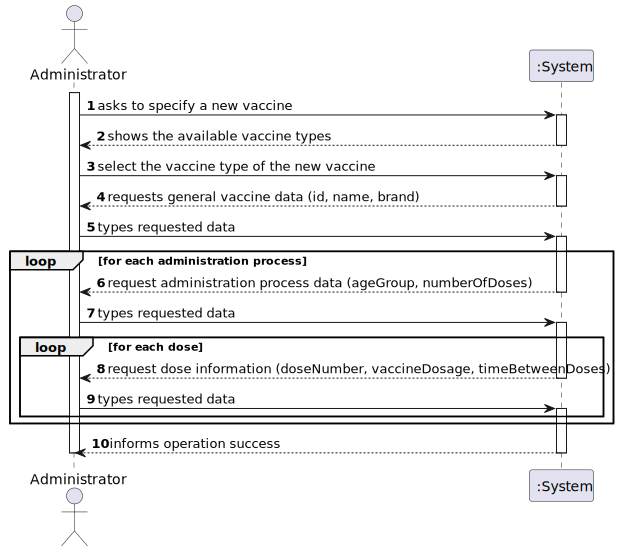

### 1.7 Other Relevant Remarks

* The first dose of any vaccine does not have time between doses, because it doesn't have any previous dose.

## 2. OO Analysis

### 2.1. Relevant Domain Model Excerpt 

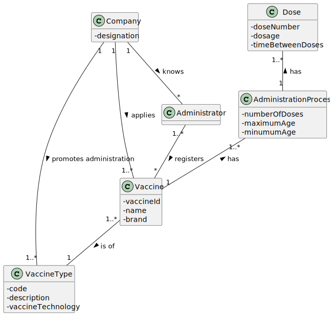

### 2.2. Other Remarks

*n/a*

## 3. Design - User Story Realization 

### 3.1. Rationale

**The rationale grounds on the SSD interactions and the identified input/output data.**

| Interaction ID | Question: Which class is responsible for... | Answer                  | Justification (with patterns)                                                                                 |
|:---------------|:--------------------------------------------|:------------------------|:--------------------------------------------------------------------------------------------------------------|
| Step 1         | ... interacting with the actor?             | CreateVaccineUI         | Pure Fabrication: there is no reason to assign this responsibility to any existing class in the Domain Model. |
|                | ... coordinating the US?                    | CreateVaccineController | Controller                                                                                                    | 
| Step 2         | ... knowing the existing vaccine types?     | Company                 | IE: knows all the vaccine types they disponibilize                                                            |
|                | ... saving the existing vaccine types?      | VaccineTypeStore        |
|                | ... creating the list to show?              | VaccineTypeMapper       | IE: knows all the vaccine types they disponibilize                                                            |
| Step 3         | n/a                                         |                         |                                                                                                               |
| Step 4         | ... knowing the information to ask?         | Vaccine                 | IE: knows its data.                                                                                           |
| Step 5         | ... validating the information inputed?     | VaccineType             | IE: knows all the vaccine they have                                                                           |
|                | ... saving the information requested?       | Vaccine                 | IE: owns its data                                                                                             |                                                                                            |
| Step 6         | ... knowing the information to aks?         | AdministrationProcess   | IE: knows its data.                                                                                           |              
| Step 7         | ... validating the information inputed?     | Vaccine                 | IE: knows all the Administration Process they have                                                            |
|                | ... saving the information requested?       | AdministrationProcess   | IE: owns its data.                                                                                            | 
| Step 8         | ... knowing the information to aks?         | Dose                    | IE: knows all its tasks.                                                                                      | 
| Step 9         | ... validating the information inputed?     | AdministrationProcess   | IE: knows all the Doses they have                                                                             |      
|                | ... saving the information requested?       | Dose                    | IE: owns all its tasks.                                                                                       | 
| Step 10        | ... informing operation success?            | CreateVaccineUI         | IE: is responsible for user interactions.                                                                     | 

### Systematization ##

According to the taken rationale, the conceptual classes promoted to software classes are: 

 * Company
 * VaccineType
 * Vaccine
 * AdministrationProcess
 * Dose

Other software classes (i.e. Pure Fabrication) identified: 

 * CreateVaccineUI
 * CreateVaccineController
 * VaccineTypeMapper
 * VaccineMapper
 * AdmProcessMapper
 * DoseMapper
 * VaccineTypeDto
 * VaccineDto
 * AdmProcessDto
 * DoseDto
 * VaccineTypeStore
 * VaccineStore
 * AdmProcessStore
 * DoseStore

## 3.2. Sequence Diagram (SD)

*US013_SD*

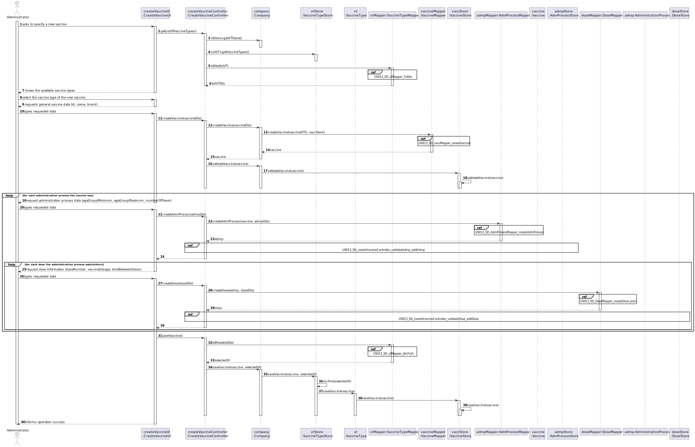

*US013_SD_vtMapper_ToDto*

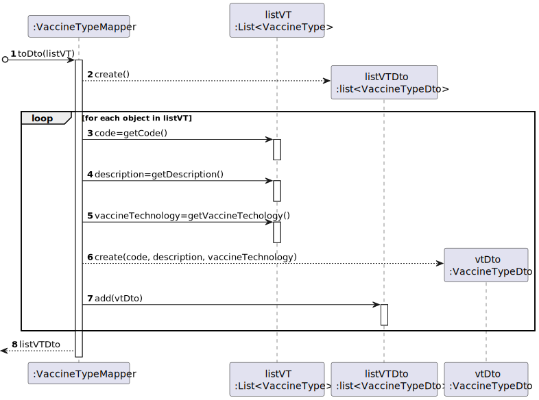

*US013_SD_vaccMapper_createVaccine*

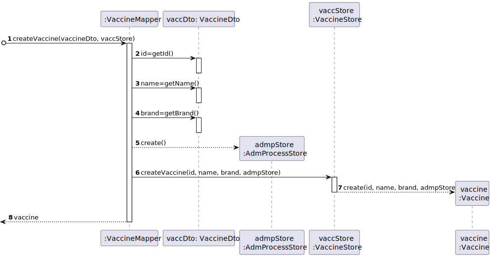

*US013_SD_AdmProcessMapper_createAdmProcess*

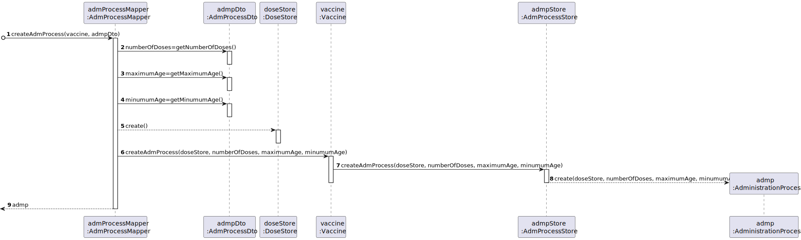

*US013_SD_createVaccineController_validateAdmp_addAdmp*

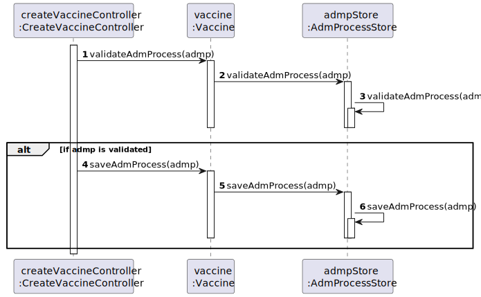

*US013_SD_DoseMapper_createDose*

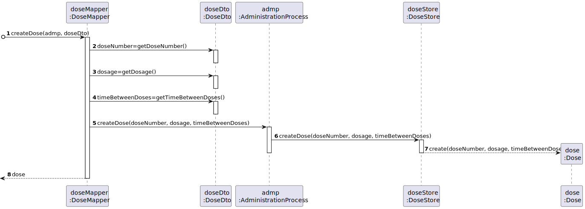

*US013_SD_createVaccineController_validateDose_addDose*

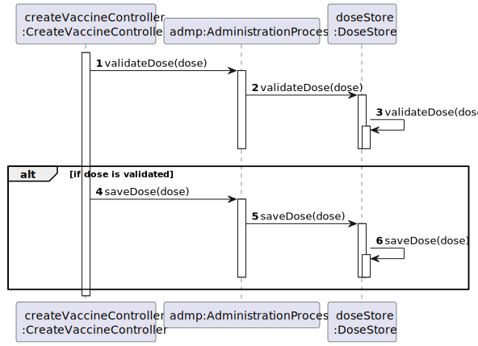

*US013_SD_vtMapper_dtoToVt*

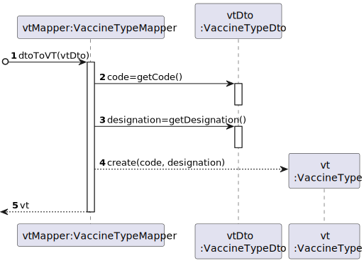

## 3.3. Class Diagram (CD)

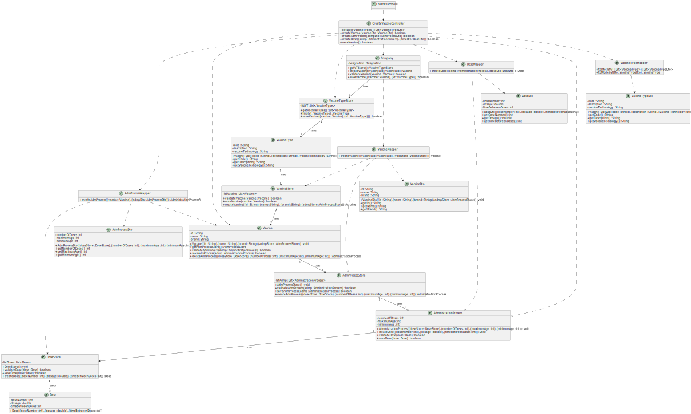

# 4. Tests 

    @Test
    void validateDose() {
    DoseStore doseStore = new DoseStore();
    Dose dose1 = new Dose(-1, 20, 2);
    Dose dose2 = new Dose(1, -1, 2);
    Dose dose3 = new Dose(1, 20, -1);
    doseStore.saveDose(dose1);
    doseStore.saveDose(dose2);
    doseStore.saveDose(dose3);
    AdministrationProcess admp = new AdministrationProcess(doseStore, 3,80,0);
    Assertions.assertFalse(admp.validateDose(dose1));
    Assertions.assertFalse(admp.validateDose(dose2));
    Assertions.assertFalse(admp.validateDose(dose3));
    }

# 5. Construction (Implementation)

## Class CreateVaccineController 

    public class CreateVaccineController {

        public List<VaccineTypeDto> getListOfVaccineTypes() {
            // ...
        }

        public boolean createVaccine(VaccineDto vaccineDto) {
            // ...
        }

        public boolean createAdmProcess(AdmProcessDto admpDto) {
            // ...
        }

        public boolean createDose(AdministrationProcess admp, DoseDto doseDto) {
            // ...;
        }

        public boolean saveDose() {
            // ...
        }
    }

## Class Company

    public class Company {
    
        private String designation;
        private AuthFacade authFacade;
        private MVCenterStore vaccinationCenterStore;
        private VaccineTypeStore vaccineTypeStore;
        private RoleStore roleStore;
        private EmployeeStore employeeStore;
    
        public Company(String designation)
        {
            if (StringUtils.isBlank(designation))
                throw new IllegalArgumentException("Designation cannot be blank.");
    
            this.designation = designation;
            this.authFacade = new AuthFacade();
            this.vaccinationCenterStore=new MVCenterStore();
            this.vaccineTypeStore=new VaccineTypeStore();
            this.roleStore=new RoleStore();
            this.employeeStore=new EmployeeStore();
        }
    
        public String getDesignation() {
            return designation;
        }
    
        public AuthFacade getAuthFacade() {
            return authFacade;
        }
    
        public MVCenterStore getMVCenterStore(){
            return vaccinationCenterStore;
        }
    
        public VaccineTypeStore getVTStore(){
            return vaccineTypeStore;
        }
        public RoleStore getRoleStore(){
            return roleStore;
        }
        public EmployeeStore getEmployeeStore(){
            return employeeStore;
        }
    }

# 6. Integration and Demo 

*There was care taken with using the same classes as related US and reusing methods used in other US.*

# 7. Observations

*None to date*
