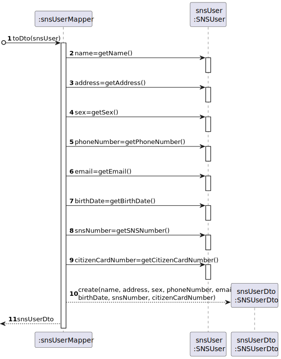

# US 005 - Consult the users in the waiting room 

## 1. Requirements Engineering

### 1.1. User Story Description

As a nurse, I intend to consult the users in the waiting room of a vacination center.

### 1.2. Customer Specifications and Clarifications 

**From the specifications document:**

>	At any time, a nurse responsible for administering the vaccine will use the application to check the list of SNS users that are present in the vaccination center to take the vaccine and will call one SNS user to administer him/her the vaccine.

>	Usually, the user that has arrived firstly will be the first one to be vaccinated (like a FIFO queue). However, sometimes, due to operational issues, that might not happen. 

>	The nurse checks the user info and health conditions in the system and in accordance with the scheduled vaccine type, and the SNS user vaccination history, (s)he gets system instructions regarding the vaccine to be administered (e.g.: vaccine and respective dosage considering the SNS user age group). 

**From the client clarifications:**

> **Question:** I would like to know which are the attributes of the waiting room.
>  
> **Answer:** The waiting room will not be registered or defined in the system. The waiting room of each vaccination center has the capacity to receive all users who take the vaccine on given slot.

> **Question:** We need to know if the nurse have to choose the vaccination center before executing the list or if that information comes from employee file?
>  
> **Answer:** When the nurse starts to use the application, firstly, the nurse should select the vaccination center where she is working. The nurse wants to check the list of SNS users that are waiting in the vaccination center where she is working.

> **Question:** Regarding US 05, what does consulting constitute in this context? Does it refer only to seeing who is present and deciding who gets the vaccine or is checking the user info to administer the vaccine, registering the process, and sending it to the recovery room also part of this US?
>
> **Answer:** The goal is to check the list of users that are waiting and ready to take the vaccine.

> **Question:** In the PI description it is said that, by now, the nurses and the receptionists will work at any center. Will this information remain the same on this Sprint, or will they work at a specific center?
>
> **Answer:** Nurses and receptionists can work in any vaccination center.

> **Question:** What information about the Users (name, SNS number, etc) should the system display when listing them?
>
> **Answer:** Name, Sex, Birth Date, SNS User Number and Phone Number.

> **Question:** Is it supposed to remove an SNS user of the wait list when he leaves the waiting room to get the vaccine? If yes, how do we know when the sns user leaves the waiting room?
> 
> **Answer:** US5 is only to list users that are in the waiting room of a vaccination center. In Sprint D we will introduce new user stories.

> **Question:** The listing is supposed to be for the day itself or for a specific day?
> 
> **Answer:** The list should show the users in the waiting room of a vaccination center.

### 1.3. Acceptance Criteria

* **AC1:** SNS Users’ list should be presented by order of arrival.

* **AC2:** The waiting room of each vaccination center has the capacity to receive all users who take the vaccine on given slot.

* **AC3:** When listing the users in the waiting list, the system shoud display the Name, Sex, Birth Date, SNS User Number and Phone Number.

* **AC4:** Nurses can work in any vaccination center.

* **AC5:** The nurse wants to check the list of SNS users that are waiting in the vaccination center where she is working.

### 1.4. Found out Dependencies

* There is a dependency to "US01 - Schedule a vaccine (SNS User)" since at least an SNS User needs to schedule a vaccine to be selectable to the Arrival List.
* There is a dependency to "US02 - Schedule a vaccine (Receptionist)" since at least an SNS User needs to schedule a vaccine to be selectable to the Arrival List.
* There is a dependency to "US04 - Register The Arrival Of A SNS User" since this User Story acesses to the Arrival List created in US04.

### 1.5 Input and Output Data

**Input Data:**

* n/a

**Output Data:**

* List of SNS Users in the waiting list

### 1.6. System Sequence Diagram (SSD)

### 1.7 Other Relevant Remarks

n/a

## 2. OO Analysis

### 2.1. Relevant Domain Model Excerpt 

### 2.2. Other Remarks

n/a

## 3. Design - User Story Realization 

### 3.1. Rationale

| Interaction ID | Question: Which class is responsible for... | Answer                       | Justification (with patterns)                                                                                 |
|:---------------|:--------------------------------------------|:-----------------------------|:--------------------------------------------------------------------------------------------------------------|
| Step 1         | ... interacting with the actor?             | ConsultWaitingRoomUI         | Pure Fabrication: there is no reason to assign this responsibility to any existing class in the Domain Model. |
|                | ... coordinating the US?                    | ConsultWaitingRoomController | Controller                                                                                                    |
|                | ... knowing the existing appointments?      | AppointmentStore             | IE: has registed all Appointments                                                                             |                                                                            
|                | ... knowing the AppointmentStore?           | VaccinationCenter            | IE: AppointmentStore are defined in the VaccinationCenter                                                     | 
| Step 2         | ... carry data from Appointment objects?    | AppointmentDTO               | DTO: no Domain class should be responsible for storing VaccineType objects information for use in the UI      |
|                | ... convert Appointment objects to DTO's?   | AppointmentMapper            | Pure Fabrication: is responsible for materialization                                                          |

### Systematization ##

According to the taken rationale, the conceptual classes promoted to software classes are: 

* Appointment
* VaccinationCenter

Other software classes (i.e. Pure Fabrication, Controller, DTO) identified: 

 * ConsultWaitingRoomUI
 * ConsultWaitingRoomController
 * AppointmentStore
 * AppointmentDTO
 * AppointmentMapper

## 3.2. Sequence Diagram (SD)

*US005_SD*

*US005_SD_appointmentMapper_toDto*

*US005_SD_snsUserMapper_ToDto*

*US005_SD_vtMapper_ToDto.puml*

## 3.3. Class Diagram (CD)

# 4. Tests 

**Test 1:** Check that the compareTo() compares properly two appointments by the arrival times

    @Test
    void testCompareTo() {
        Appointment appointment = new Appointment(new VaccineType("code", "description", "vaccineTechnology"), new SNSUser("name", "adress", "sex", 919191919, "email@email.com", new Date(), 123456789, 123456789), new Date(), new Date());
        Appointment appointment1 = new Appointment(new VaccineType("code", "description", "vaccineTechnology"), new SNSUser("name", "adress", "sex", 919191919, "email@email.com", new Date(), 123456789, 123456789), new Date(), new Date());
        Appointment appointment2 = new Appointment(new VaccineType("code", "description", "vaccineTechnology"), new SNSUser("name", "adress", "sex", 919191919, "email@email.com", new Date(), 123456789, 123456789), new Date(), new Date());
        appointment.setSNSUserArrivalTime(new Date());
        appointment1.setSNSUserArrivalTime(new Date(appointment.getSNSUserArrivalTime().getTime()+1000000000));
        appointment2.setSNSUserArrivalTime(new Date(appointment.getSNSUserArrivalTime().getTime()-1000000000));
        int result1 = appointment.compareTo(appointment1);
        int result2 = appointment.compareTo(appointment2);
        Assertions.assertEquals(-1, result1);
        Assertions.assertEquals(1, result2);
    }

**Test 2:** Check if the checkStateWaiting() method checks correcty if the appointment is in waiting state or not 

    @Test
    void testCheckStateWaiting() {
        Appointment appointment = new Appointment(new VaccineType("code", "description", "vaccineTechnology"), new SNSUser("name", "adress", "sex", 919191919, "email@email.com", new Date(), 123456789, 123456789), new Date(), new Date());
        appointment.setStateWaiting();
        boolean result = appointment.checkStateWaiting();
        Assertions.assertEquals(true, result);
    }

# 5. Construction (Implementation)

## Class ConsultWaitingRoomController

	public class ConsultWaitingRoomController {

		public ConsultWaitingRoomController() {}

		public List<AppointmentDto> getWaitingListDTO(VaccinationCenter vaccinationCenter) {
			Date dateToCheck = new Date();
			return AppointmentMapper.toDto(vaccinationCenter.getWaitingList(dateToCheck));
		}
	}

## Class Appointment

	public class Appointment implements Comparable<Appointment>{

		private VaccineType vaccineType;

		private SNSUser snsUser;

		private Date date;

		private Date time;

		private Date snsUserArrivalTime;

		@Override
		public int compareTo(Appointment appointment) {
			return snsUserArrivalTime.compareTo(appointment.getDate());
		}

		private enum State {
			TODO,
			WAITING,
			DONE;
		}

		private State state;

		public Appointment(VaccineType vaccineType, SNSUser snsUser, Date date, Date time) {
			setVaccineType(vaccineType);
			setSnsUser(snsUser);
			setDate(date);
			setTime(time);
			setStateToDo();
		}

		public Date getDate() {
			return date;
		}

		public void setDate(Date date) {
			this.date = date;
		}

		public Date getTime() {
			return time;
		}

		public void setTime(Date time) {
			this.time = time;
		}

		public VaccineType getVaccineType() {
			return vaccineType;
		}

		public void setVaccineType(VaccineType vaccineType) {
			this.vaccineType = vaccineType;
		}

		public SNSUser getSnsUser() {
			return snsUser;
		}

		public void setSnsUser(SNSUser snsUser) {
			this.snsUser = snsUser;
		}

		public boolean checkStateToDo() {
			return state == State.TODO;
		}

		public boolean checkStateWaiting() {
			return state == State.WAITING;
		}

		public boolean checkStateDone() {
			return state == State.DONE;
		}

		public void setStateToDo() {
			this.state = State.TODO;
		}

		public void setStateWaiting() {
			this.state = State.WAITING;
		}

		public void setStateDone(){
			this.state = State.DONE;
		}

		@Override
		public String toString() {
			return "Appointment: [" +
					"vaccineType=" + vaccineType +
					", snsUser=" + snsUser +
					", date=" + DateFormat.getDateInstance().format(date) +
					", time=" + DateFormat.getTimeInstance().format(time) +
					']';
		}
	}

# 6. Integration and Demo 

* A new option on the Nurse menu options was added.

# 7. Observations

n/a