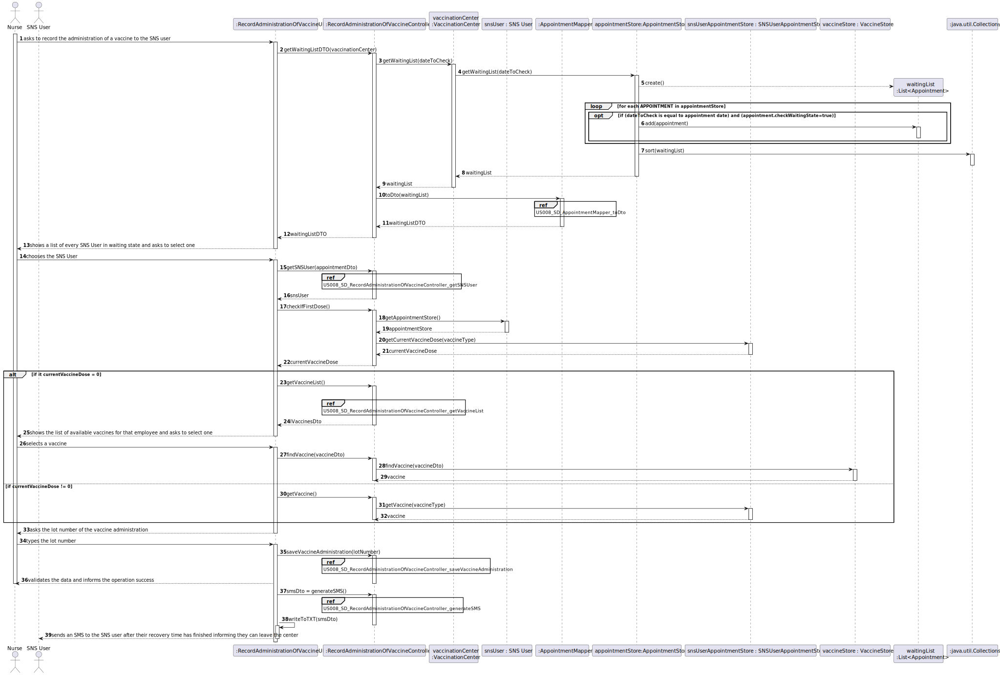

# US 008 - Record the Administration Of A Vaccine

## 1. Requirements Engineering

### 1.1. User Story Description

*As a nurse, I want to record the administration of a vaccine to a SNS user. At the end of the recovery period, the user should receive a SMS message informing the SNS user that he can leave the vaccination center.*

### 1.2. Customer Specifications and Clarifications

**From the specifications document:**

>	After giving the vaccine to the user, each nurse registers the event in the system, more precisely, registers the vaccine type (e.g.: Covid-19), vaccine name/brand (e.g.: Astra Zeneca, Moderna, Pfizer), and the lot number used. 

>   Afterwards, the nurse sends the user to a recovery room, to stay there for a given recovery period (e.g.: 30 minutes). 

>   If there are no problems, after the given recovery period, the user should leave the vaccination center. The system should be able to notify (e.g.: SMS or email) the user that his/her recovery period has ended.

**From the client clarifications:**

>	**Question:** "Previously the client answered that: "1. The nurse selects a SNS user from a list. 2. Checks user's Name, Age and Adverse Reactions registered in the system." However, our group has five members and the US07: Register an adverse reaction is not obligatory to be implemented. So, with this in mind we would like to know if we, in step 2, should only show the Name and the Age or other information".
>
>	**Answer:** If your team does not implement US7, then you should show a message saying "No Adverse Reactions registered in the system".

>	**Question:** "As we can read in Project Description, the vaccination flow follows these steps: 1. Nurse calls one user that is waiting in the waiting room to be vaccinated; 2. Nurse checks the user's health data as well as which vaccine to administer; 3. Nurse administers the vaccine and registers its information in the system. The doubt is: do you want US08 to cover steps 2 and 3, or just step 3?".
>
>	**Answer:** 1.The nurse selects a SNS user from a list. 2. Checks user's Name, Age and Adverse Reactions registered in the system. 3. Registers information about the administered vaccine.

>	**Question:** "Regarding the recovery period, how should we define it? Is it the same for all vaccines or should the nurse specify in each case what the recovery time is?".
>
>	**Answer:** The recovery period/time is the same for all vaccines. The recovery period/time should be defined in a configuration file.

>	**Question:** "Supposing that the SNS user has already received a dose of a given vaccine type (for example, COVID-19), the user can only receive the same vaccine or a different one with the same vaccine type?"
>
>	**Answer:** The SNS user can only receive the same vaccine. Related information: A SNS user is fully vaccinated when he receives all doses of a given vaccine. A SNS user that has received a single-dose vaccine is considered fully vaccinated and will not take more doses. A SNS user that is fully vaccinated will not be able to schedule a new vaccine of the type for which he is already fully vaccinated.

>	**Question:** "To access the user info - scheduled vaccine type and vaccination history -, should the nurse enter user's SNS number?"
>
>	**Answer:** The nurse should select a SNS user from a list of users that are in the center to take the vaccine.

>	**Question:** "In US 08 says: "At the end of the recovery period, the user should receive a SMS message informing the SNS user that he can leave the vaccination center." How should the SNS user receive and have access to the SMS message?"
>
>	**Answer:**  I already answered this question. Please pay attention to the client answers. A file named SMS.txt should be used to receive/record the SMS messages. We will not use a real word service to send SMSs.

>	**Question:** "1: Is the nurse responsible for registering in the system the recovery period? 2: If there are no adverse reactions detected/registered, after the given recovery period, the system notifies the user that his/her recovery period has ended, right? 3: If there are adverse reactions detected/registered, the system should not do anything additional?"
>
>	**Answer:** 1- No. The recovery period starts automatically after registering the administration of a given vaccine. 2 and 3- US7 and US 8 are independent user stories.

>	**Question:** "1: The system displays the list of possible vaccines to be administered (considering the age group of the user); then the nurse selects the dose she is going to administer and gets information about the dosage. But wouldn't it be more correct, since the system knows the vaccination history, in other words, if the user has already take x dose(s) of that vaccine, to simply show the dose and the respective dosage and not ask for the nurse to arbitrarily select it? 2: After giving the vaccine to the user, how should the nurse register the vaccine type? by the code?"
>
>	**Answer:** 1- If it is the first dose, the application should show the list of possible vaccines to be administered. If is is not a single dose vaccine, when the SNS user arrives to take the vaccine, the system should simply show the dose and the respective dosage. 2- A vaccine is associated with a given vaccine type. Therefore, there is no need to register the vaccine type. Moreover, the nurse should also register the vaccine lot number (the lot number has five alphanumeric characters an hyphen and two numerical characters (example: 21C16-05)).

### 1.3. Acceptance Criteria

* **AC1:** Show a message saying "No Adverse Reactions registered in the system" if US08 is not implemented.
* **AC2:** The SNS user should be selected by the nurse from a list.
* **AC3:** The recovery period/time is the same for all vaccines.
* **AC4:** The recovery period/time should be defined in a configuration file.
* **AC5:** The SNS user can only receive the same vaccine as the one administered on their first dose.
* **AC6:** A SNS user that is fully vaccinated will not be able to schedule a new vaccine of the type for which he is already fully vaccinated.
* **AC7:** A file named SMS.txt should be used to receive/record the SMS messages.
* **AC8:** The recovery period starts automatically after registering the administration of a given vaccine.
* **AC9:** If it is not a single dose vaccine, when the SNS user arrives to take the vaccine, the system should simply show the dose and the respective dosage.
* **AC10:** The nurse should register the vaccine lot number (the lot number has five alphanumeric characters an hyphen and two numerical characters (example: 21C16-05)).

### 1.4. Found out Dependencies

* There is a dependency to "US03 - Register a SNS User (Receptionist)" since at least an SNS User needs to be created so a recording of a vaccine administration can happen.
* There is a dependency to "US09 - Register vaccination center (Administrator)" since at least a vaccination center must be created so a Nurse can operate in it and be able to record the vaccine administration.
* There is a dependency to "US10 - Register an Employee (Administrator)" since at least a Nurse needs to be created so a vaccine administration can be recorded.
* There is a dependency to "US12 - Specify new vaccine type (Administrator)" since at least a vaccine type must be created so a recording of a vaccine administration can happen.
* There is a dependency to "US13 - Specify new vaccine and its administration process (Administrator)" since for a vaccine administrator be recorded, there must first be at least an administration process and a vaccine.

### 1.5 Input and Output Data

**Input Data:**

* Typed data:
    * lotNumber

* Selected data:
    * snsUser
    * vaccine

**Output Data:**

* List of every SNS User in waiting state
* list of available vaccines
* sms informing the user can leave the center
* success of the operation

### 1.6. System Sequence Diagram (SSD)

### 1.7 Other Relevant Remarks

* The selection of the vaccine by the nurse only happens if the sns user has never been administered any dose of the vaccine 

## 2. OO Analysis

### 2.1. Relevant Domain Model Excerpt

### 2.2. Other Remarks

* n/a

## 3. Design - User Story Realization

### 3.1. Rationale

| Interaction ID | Question: Which class is responsible for...                              | Answer                                                                | Justification (with patterns)                                                                                            |
|:---------------|:-------------------------------------------------------------------------|:----------------------------------------------------------------------|:-------------------------------------------------------------------------------------------------------------------------|
| Step 1         | ... interacting with the actor?                                          | RecordAdministrationOfVaccineUI                                       | Pure Fabrication: UI is responsible for the interaction with the actor                                                   |
|                | ... coordinating the US?                                                 | RecordAdministrationOfVaccineController                               | Controller: Represents a use case scenario (RecordAdministrationOfVaccine)                                               |
|                | ... knowing the waiting list                                             | AppointmentStore                                                      | IE: has registered all SNS User appointments                                                                             |
|                | ... creating the list to show?                                           | AppointmentMapper                                                     | Pure Fabrication: non Domain class responsible for materializing AppointmentDto objects for use in the UI                |
| Step 2         | ... showing the list of sns users?                                       | RecordAdministrationOfVaccineUI                                       | Pure Fabrication: UI is responsible for the interaction with the actor                                                   |
| Step 3         | ... knowing the sns user?                                                | AppointmentDTO                                                        | DTO: holds Appointment data required for printing in UI                                                                  |
|                | ... knowing the sns number of the sns user?                              | SNSUserDTO                                                            | DTO: holds SNSUser data required for printing in UI                                                                      | 
|                | ... knowing the store of sns users?                                      | Company                                                               | IE: knows list of its own SNS Users                                                                                      |
|                | ... knowing the the corresponding sns user?                              | SNSUserStore                                                          | Pure Fabrication: Company delegates responsibility to store and perform operations in SNS Users supporting high cohesion |
|                | ... knowing the appointment store?                                       | SNSUser                                                               | IE: knows list of its own appointments                                                                                   |
|                | ... knowing the corresponding appointment from the appointmentDto?       | SNSUserAppointmentStore                                               | IE: has registered all SNS User appointments                                                                             |
 |                | ... knowing the current vaccine dose?                                    | SNSUserAppointmentStore                                               | IE: knows its own data                                                                                                   |
|                | ... knowing the vaccine type?                                            | AppointmentDTO                                                        | DTO: holds Appointment data required for printing in UI                                                                  |
|                | ... knowing the vaccine type store?                                      | Company                                                               | IE: knows list of its own SNS Users vaccine type                                                                         |
|                | ... knowing the corresponding vaccineType from the vaccineTypeDto?       | VaccineTypeStore                                                      | IE: has registered every Vaccine Type                                                                                    |
 |                | ... knowing the vaccine store?                                           | VaccineType                                                           | IE: knows all data about the vaccine type                                                                                |
|                | ... knowing the vaccine list?                                            | VaccineStore                                                          | IE: knows its own data                                                                                                   |
|                | ... creating the list to show?                                           | VaccineMapper                                                         | Pure Fabrication: non Domain class responsible for materializing VaccineDto objects for use in the UI                    |
| Step 4         | ... showing the list of available vaccines?                              | RecordAdministrationOfVaccineUI                                       | Pure Fabrication: UI is responsible for the interaction with the actor                                                   |
| Step 5         | ... knowing the corresponding vaccine from the vaccineDto?               | VaccineStore                                                          | IE: knows its own data                                                                                                   |
|                | ... knowing vaccine if the user has already been vaccinated with a dose? | SNSUserAppointmentStore                                               | IE: knows its own data                                                                                                   |
| Step 6         | ... interacting with the actor to ask for the lot number?                | RecordAdministrationOfVaccineUI                                       | Pure Fabrication: UI is responsible for the interaction with the actor                                                   |
| Step 7         | ... knowing the administration process store?                            | Vaccine                                                               | IE: knows all data about the vaccine                                                                                     |
 |                | ... knowing the sns user age?                                            | SNSUser                                                               | IE: knows all data about the appointments                                                                                | 
 |                | ... knowing the administration process by age?                           | AdmpProcessStore                                                      | IE: knows all data about the administration process                                                                      |
 |                | ... knowing the dose?                                                    | DoseStore                                                             | IE: knows its own data                                                                                                   |
 |                | ... save the vaccine administration?                                     | Appointment                                                           | IE: knows all data about the appointment of the SNS User                                                                 | 
 |                | ... changing the state to done?                                          | Appointment                                                           | IE: knows its own data                                                                                                   |
 |                | ... setting the sns user leave time?                                     | Appointment                                                           | IE: knows its own data                                                                                                   |
| Step 6         | ... informing the success of the operation?                              | RecordAdministrationOfVaccineUI                                       | Pure Fabrication: UI is responsible for the interaction with the actor                                                   |
 |                | ... generating the SMS?                                                  | SMSStore                                                              | IE: has registered all SMS                                                                                               |
 |                | ... knowing the corresponding smsDto from the sms?                       | SMSMapper                                                             | Pure Fabrication: non Domain class responsible for materializing smsDto objects for use in the UI                        |
 |                | ... writing the SMS to a txt file?                                       | RecordAdministrationOfVaccineUI                                       | Pure Fabrication: UI is responsible for the interaction with the actor                                                   |
 | Step 7         | ... sending the SMS?                                                     | RecordAdministrationOfVaccineUI                                       | Pure Fabrication: UI is responsible for the interaction with the actor                                                   |

### Systematization ##

According to the taken rationale, the conceptual classes promoted to software classes are:

* Company
* SNSUser
* VacineType
* Vaccine
* SNSUser
* Appointment

Other software classes (i.e. Pure Fabrication) identified:
* RecordAdministrationOfVaccineUI
* RecordAdministrationOfVaccineController
* AppointmentStore
* AppointmentMapper
* AppointmentDTO
* SNSUserDTO
* SNSUserStore
* SNSUserAppointmentStore
* VaccineTypeStore
* VaccineStore
* VaccineMapper
* AdmpProcessStore
* DoseStore
* SMSStore
* SMSMapper

## 3.2. Sequence Diagram (SD)

*US008_SD_AppointmentMapper_toDto*

*US008_SD_RecordAdministrationOfVaccineController_generateSMS*

*US008_SD_RecordAdministrationOfVaccineController_getSNSUser*

*US008_SD_RecordAdministrationOfVaccineController_getVaccineList*

*US008_SD_RecordAdministrationOfVaccineController_saveVaccineAdministration*

*US008_SD_SNSUserMapper_ToDto*

*US008_SD_VaccineMapper_toDto*

*US008_SD_VaccineTypeMapper_ToDto*

## 3.3. Class Diagram (CD)

# 4. Tests

**Test 1:** Tests if two doseStores are equal.

	    @Test 
    void testEquals() {
        DoseStore doseStore1 = new DoseStore();
        DoseStore doseStore2 = new DoseStore();
        DoseStore doseStore3 = new DoseStore();
        Dose dose = new Dose(1,10,20);
        doseStore1.saveDose(dose);
        doseStore2.saveDose(dose);
        Assertions.assertTrue(doseStore1.equals(doseStore2));
        Assertions.assertFalse(doseStore1.equals(doseStore3));
    }

**Test 2:** Tests if the numberOfDoses method is working correctly.

    @Test
    void numberOfDoses() {
        int numberOfDoses = 1;
        DoseStore doseStore = new DoseStore();
        Dose dose = doseStore.createDose(3, 20, 30);
        doseStore.saveDose(dose);
        Assertions.assertEquals(doseStore.numberOfDoses(), numberOfDoses);
    }

# 5. Construction (Implementation)

## Class RecordAdministrationOfVaccineController

    public class RecordAdministrationOfVaccineController {

    private SNSUserStore snsUserStore;

    private SNSUser snsUser;

    private SNSUserAppointmentStore snsUserAppointmentStore;

    private AppointmentDto appointmentDTO;

    private VaccineStore vaccineStore;

    private VaccineType vaccineType;

    private LocalDate dateToCheck;

    private Vaccine vaccine;

    private int currentVaccineDose;

    private LocalDateTime dateOfAdministration;

    private Dose dose;

    private Appointment appointment;

    private final Company company;
    private final VaccinationCenter vaccinationCenter;

    public RecordAdministrationOfVaccineController(VaccinationCenter vaccinationCenter) {
        this.vaccinationCenter=vaccinationCenter;
        this.company = App.getInstance().getCompany();
    }

    public List<AppointmentDto> getWaitingListDTO(){
        this.dateToCheck = LocalDate.now();
        List<Appointment> waitingList = vaccinationCenter.getWaitingList(dateToCheck);
        List <AppointmentDto> waitingListDTO = AppointmentMapper.toDto(waitingList);
        return waitingListDTO;
    }

    public void getSNSUser(AppointmentDto appointmentDto) {
        SNSUserDTO snsUserDTO = appointmentDto.getSnsUser();
        long snsNumber = snsUserDTO.getSnsNumber();
        this.snsUserStore = company.getSnsUserStore();
        this.snsUser = snsUserStore.findSnsUserByNumber(snsNumber);
    }

    public int getCurrentDose() {
        this.vaccineType = appointment.getVaccineType();
        int currentVaccineDose = snsUserAppointmentStore.getCurrentVaccineDose(vaccineType);
        return currentVaccineDose;
    }

    public List<VaccineDto> getVaccineList(AppointmentDto appointmentDTO) {
        VaccineTypeDto vaccineTypeDto = appointmentDTO.getVaccineType();
        VaccineTypeStore vaccineTypeStore = company.getVaccineTypeStore();
        this.vaccineType = vaccineTypeStore.find(vaccineTypeDto);
        this.vaccineStore = vaccineType.getVaccineStore();
        List<Vaccine> lVaccines = vaccineStore.getVaccineList();
        List<VaccineDto> lVaccinesDto = VaccineMapper.toDto(lVaccines);
        return lVaccinesDto;

    }

    public void findVaccine(VaccineDto vaccineDto) {
        this.vaccine = vaccineStore.findVaccine(vaccineDto);
    }

    public void getVaccine() throws Exception {
        this.vaccine = snsUserAppointmentStore.getVaccine(vaccineType);
    }

    public void saveVaccineAdministration(String lotNumber, LocalTime leavingTime) throws Exception {
        AdmProcessStore admpStore = vaccine.getAdmProcessStore();
        int age = snsUser.getAge();
        AdministrationProcess admp = admpStore.getAdmProcess(age);
        Dose dose = admp.findDose(currentVaccineDose+1);
        appointment.addVaccineAdministration(lotNumber, dateOfAdministration, vaccine, admp, dose, leavingTime);

    }

    public void findAppointment(AppointmentDto appointmentDTO) throws Exception {
        this.snsUserAppointmentStore = snsUser.getSnsUserAppointmentStore();
        this.appointment = snsUserAppointmentStore.findAppointment(appointmentDTO);
    }

    public SMSDto generateSMS() {
        SMSStore smsStore = snsUser.getSmsStore();
        SMS sms = smsStore.generateSMS();
        return SMSMapper.smsToDto(sms);
    }

## Class SMSStore

    public class SMSStore implements Serializable {

    private List<SMS> listSMS;

    public SMS generateSMS(Appointment appointment, VaccinationCenter vaccinationCenter){
    SMS sms= new SMS(appointment,vaccinationCenter);
    listSMS.add(sms);
    return sms;
    }

    public SMSStore() {
        this.listSMS=new ArrayList<>();
    }

    public SMS generateSMS() {
        SMS sms= new SMS();
        listSMS.add(sms);
        return sms;
        }
    }

# 6. Integration and Demo

* A new option on the Nurse menu options was added.

# 7. Observations

n/a