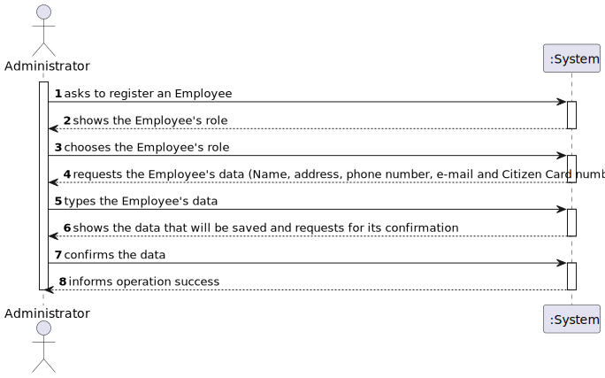
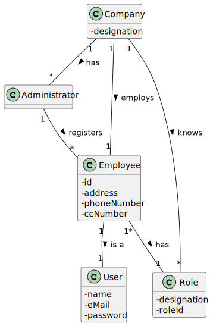
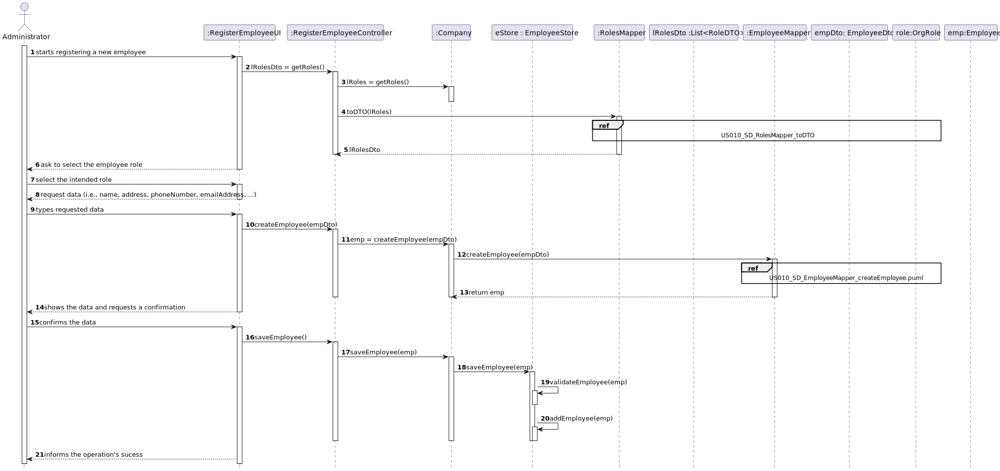
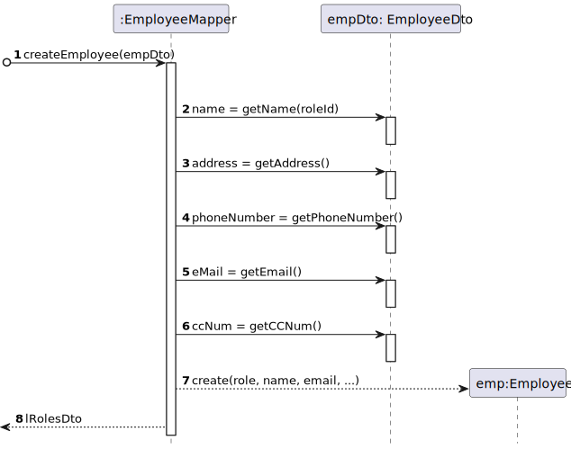
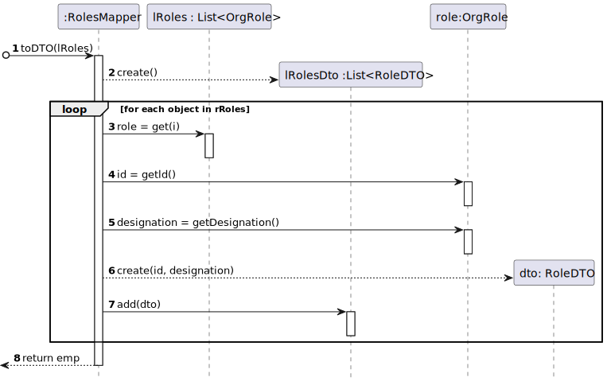
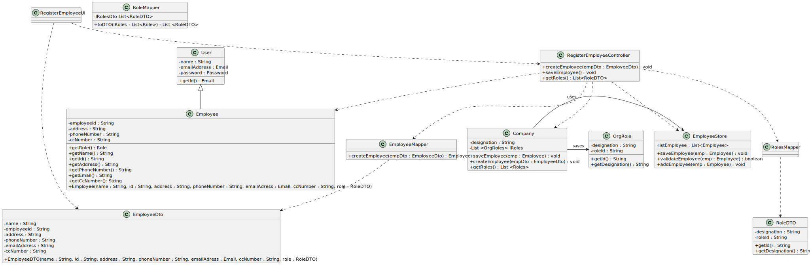

# US 010 - Register An Employee

## 1. Requirements Engineering

### 1.1. User Story Description

As an administrator, I want to register an Employee.

### 1.2. Customer Specifications and Clarifications 

**From the specifications document:**

>	Any Administrator uses the
application to register centers, SNS users, center coordinators, receptionists, and nurses enrolled in
the vaccination process.

**From the client clarifications:**

> **Question:** Besides a password and a user name, what other (if any) information should the Admin use to register a new employee? Are any of them optional?
>  
> **Answer:** Every Employee has only one role (Coordinator, Receptionist, Nurse).
Employee attributes: Id (automatic), Name, address, phone number, e-mail and Citizen Card number.
All attributes are mandatory. 

### 1.3. Acceptance Criteria

* **AC1:** Each user must have a single role defined in the system.
* **AC2:** The "auth" component available on the repository must be reused (without modifications).

### 1.4. Found out Dependencies

* None to date

### 1.5 Input and Output Data

**Input Data:**

* Typed data:
    * name of the employee
    * adress of the employee
    * phone number of the employee
    * e-mail of the employee
    * citizen card number of the employee
	
* Selected data:
	* role of the employee 

**Output Data:**

* List of every available role for an employee
* During the data confirmation phase, the employees data that was introduced by the administrator
* (In)Success of the operation

### 1.6. System Sequence Diagram (SSD)

### 1.7 Other Relevant Remarks

* The created task stays in a "not published" state in order to distinguish from "published" tasks.

## 2. OO Analysis

### 2.1. Relevant Domain Model Excerpt 

### 2.2. Other Remarks

n/a

## 3. Design - User Story Realization 

### 3.1. Rationale

**SSD - Alternative 1 is adopted.**

| Interaction ID | Question: Which class is responsible for... | Answer   | Justification (with patterns)        |
|:---------------|:--------------------------------------------|:---------|:-------------------------------------|
| Step 1  		     | ... instantiating a new Employee?           | Company  | Creator: R1/2                        |
| Step 2  		     | ... show available roles                    | UI       | IE: responsible for user interaction |
| Step 3  		     | ... recording Employee roles                | Company  | Creator: R2                          |
| Step 4  		     | n/a                                         |          |                                      |
| Step 5         | ... saving the Employee's data              | Employee | IE: records its own data             |
| Step 6  		     | ... validating the data locally?            | Employee | IE: knows its own data               |
| 	              | ... validating the data globally?           | Company  | IE: knows all the Employee objects   |
| Step 7  		     | ... saving the created Employee?            | Company  | IE: records all the Employee objects |
| Step 8  		     | ... informing of operation success?         | UI       | IE: responsible for user interaction |

### Systematization ##

According to the taken rationale, the conceptual classes promoted to software classes are: 

 * Company
 * Employee

Other software classes (i.e. Pure Fabrication) identified: 

 * RegisterEmployeeUI  
 * RegisterEmployeeController
 * RoleDTO
 * EmployeeDto
 * EmployeeMapper
 * RolesMapper
 * EmployeeStore

## 3.2. Sequence Diagram (SD)

*US010_SD*

*US010_SD_EmployeeMapper_createEmployee*

*US010_SD_RolesMapper_toDTO*

## 3.3. Class Diagram (CD)

# 4. Tests 

    @Test
    void saveEmployee() {
        empStore.saveEmployee(employee1);
        assertEquals(listEmployee, empStore.getListOfEmployees());

    }

    @Test
    void validateEmployee() {
        assertFalse(empStore.validateEmployee(null));
        assertTrue(empStore.validateEmployee(employee1));
    }

    @Test
    void addEmployee() {
        empStore.addEmployee(employee2);
        assertEquals(listEmployee2, empStore.getListOfEmployees() );
    }

# 5. Construction (Implementation)

## Class RegisterEmployeeController 

    public class RegisterEmployeeController {

    public void createEmployee(EmployeeDTO empDto) {}

    public void saveEmployee() {}

    public List<RoleDTO> getRoles() {
        return null;
    }

## Class Company

    public class Company {

    private String designation;
    private AuthFacade authFacade;
    private MVCenterStore vaccinationCenterStore;
    private VaccineTypeStore vaccineTypeStore;
    private RoleStore roleStore;
    private EmployeeStore employeeStore;

    public Company(String designation)
    {
        if (StringUtils.isBlank(designation))
            throw new IllegalArgumentException("Designation cannot be blank.");

        this.designation = designation;
        this.authFacade = new AuthFacade();
        this.vaccinationCenterStore=new MVCenterStore();
        this.vaccineTypeStore=new VaccineTypeStore();
        this.roleStore=new RoleStore();
        this.employeeStore=new EmployeeStore();
    }

    public String getDesignation() {
        return designation;
    }

    public AuthFacade getAuthFacade() {
        return authFacade;
    }

    public MVCenterStore getMVCenterStore(){
        return vaccinationCenterStore;
    }

    public VaccineTypeStore getVTStore(){
        return vaccineTypeStore;
    }
    public RoleStore getRoleStore(){
        return roleStore;
    }
    public EmployeeStore getEmployeeStore(){
        return employeeStore;
    }

# 6. Integration and Demo 

*There was care taken with using the same classes as related US and reusing methods used in other US.*

# 7. Observations

*None to date.*

