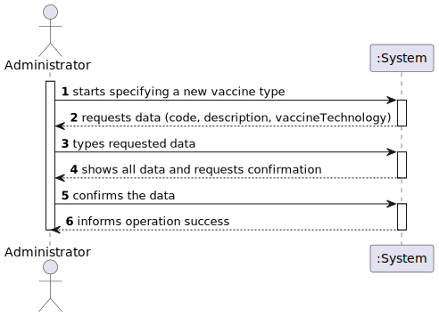
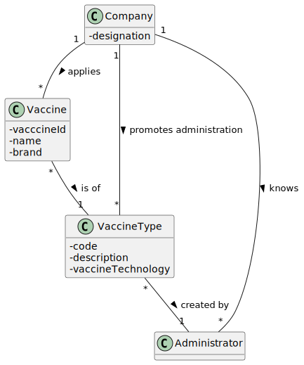
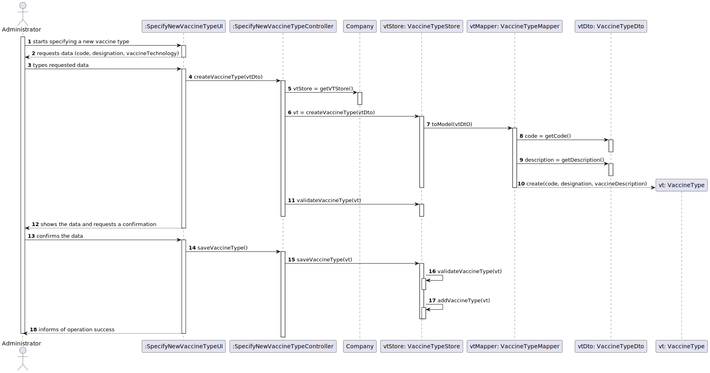
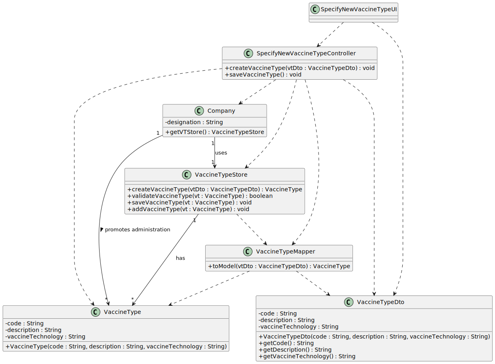

# US 012 - Specify a New Vaccine Type

## 1. Requirements Engineering

### 1.1. User Story Description

*As an administrator, I intend to specify a new vaccine type.*

### 1.2. Customer Specifications and Clarifications

**From the Specifications Document:**

> "the community mass vaccination centers are facilities specifically created to administer vaccines of a single type"
 
>  "healthcare center […] can administer any type of vaccines (e.g.: Covid-19, Dengue, Tetanus, smallpox)."
 
> “for each type of vaccine, it might exist several vaccines”

**From the client clarification:**

>Question: "What kind of information would you like to include in a new type of vaccine?"

>Answer:
The vaccine type should have the following attributes: Code (five alphanumeric characters), Short description and Vaccine technology. Please check the web page above to identify the six types of vaccine technologies that can be selected.
https://www.pfizer.com/news/articles/understanding_six_types_of_vaccine_technologies

### 1.3. Acceptance Criteria

> AC1: Code must have 5 alphanumeric chars

### 1.4. Found out Dependencies

*No dependencias were found.*

### 1.5 Input and Output Data

**Input Data:**

* **Typed data:**
    * a code
    * a description
    * a vaccine technology

* **Selected Data:**
  * (none)

**Output Data:**

  * (In)Success of the operation

### 1.6. System Sequence Diagram (SSD)

### 1.7 Other Relevant Remarks

*n/a*

## 2. OO Analysis

### 2.1. Relevant Domain Model Excerpt 

### 2.2. Other Remarks

*n/a*

## 3. Design - User Story Realization 

### 3.1. Rationale

**The rationale grounds on the SSD interactions and the identified input/output data.**

| Interaction ID | Question: Which class is responsible for...                                      | Answer      | Justification (with patterns)                      |
|:---------------|:---------------------------------------------------------------------------------|:------------|:---------------------------------------------------|
| Step 1         | 	... instantiating a new Vaccine Type?						                                     | Company     | Creator: R1/2                                      |
| Step 2         | 	n/a						                                                                       |             |                                                    |
| Step 3         | 	... saving the input data						                                                 | VaccineType | IE: the object created in step 1 has its own data. |
| Step 4         | 	... validating the data locally (e.g.: mandatory vs. non-mandatory data)?						 | VaccineType | IE: knows its own data.                            |
| Step 5         | 	... validating the data globally (e.g.: duplicated)?						                      | Company     | IE: knows all the VaccineType objects.             |
| Step 6         | 	... saving the created vaccine type?						                                      | Company     | IE: adopts/records all the VaccineType objects.    |              
| Step 7         | 	... informing operation success?						                                          | UI          | IE: responsible for user interaction.              |

### Systematization ##

According to the taken rationale, the conceptual classes promoted to software classes are: 

 * Company
 * VaccineType

Other software classes (i.e. Pure Fabrication) identified: 
 * SpecifyNewVaccineTypeUI  
 * SpecifyNewVaccineTypeController
 * VaccineTypeStore
 * VaccineTypeMapper
 * VaccineTypeDto

## 3.2. Sequence Diagram (SD)

## 3.3. Class Diagram (CD)

# 4. Tests 

**Test 1:** Check that it is not possible to save an instance of VaccineType with code that doesn't meet AC1.

    @Test
    void codeValidation() {
        assertTrue(VaccineTypeArgumentValidation.codeValidation(vtTest));
        assertFalse(VaccineTypeArgumentValidation.codeValidation(vtTest2));
    }

**Test 2:** Check that it is not possible to save an instance of VaccineType with description empty or blank.

    @Test
    void descriptionValidation() {
        assertTrue(VaccineTypeArgumentValidation.descriptionValidation(vtTest));
        assertFalse(VaccineTypeArgumentValidation.descriptionValidation(vtTest3));
        assertFalse(VaccineTypeArgumentValidation.descriptionValidation(vtTest4));
    }

# 5. Construction (Implementation)

## Class SpecifyNewVaccineTypeController

    public class SpecifyNewVaccineTypeController {
        private Company company;
        private VaccineTypeDto vtDto;
        private VaccineType vt;
        private VaccineTypeStore vtStore;

        public SpecifyNewVaccineTypeController() {
            this(App.getInstance().getCompany());
        }

        public SpecifyNewVaccineTypeController(Company company) {
            this.company = company;
            this.vtDto = null;
            this.vt = null;
            this.vtStore = company.getVTStore();
        }

        public void saveVaccineType(){
            vtStore.saveVaccineType(vt);
        }

        public boolean createVaccineType(VaccineTypeDto vtDto){
            this.vt = vtStore.createVaccineType(vtDto);
            return vtStore.validateVaccineType(vt);
        }

        public void printVaccineTypeStore() {
            vtStore.printVaccineTypeStore();
        }
    }

## Class Company

    public class Company {

        private String designation;
        private AuthFacade authFacade;
        private MVCenterStore vaccinationCenterStore;
        private VaccineTypeStore vaccineTypeStore;
        private static RoleStore roleStore;

        private static EmployeeStore empStore;
        public Company(String designation) {
            if (StringUtils.isBlank(designation))
                throw new IllegalArgumentException("Designation cannot be blank.");

            this.designation = designation;
            this.authFacade = new AuthFacade();
            this.vaccinationCenterStore=new MVCenterStore();
            this.vaccineTypeStore=new VaccineTypeStore();
            this.roleStore=new RoleStore();
            this.empStore=new EmployeeStore();
        }

        public String getDesignation() {
            return designation;
        }

        public AuthFacade getAuthFacade() {
            return authFacade;
        }

        public MVCenterStore getMVCenterStore(){
            return vaccinationCenterStore;
        }

        public VaccineTypeStore getVTStore(){
            return vaccineTypeStore;
        }

        public static RoleStore getRoleStore(){
            return roleStore;
        }

        public static EmployeeStore getEmployeeStore(){
            return empStore;
        }

        public Vaccine createVaccine(VaccineDto vaccineDto, VaccineType vt) {
            return vaccineTypeStore.createVaccine(vaccineDto, vt);
        }

        public boolean validateVaccine(Vaccine vaccine, VaccineType selectedVt) {
            return vaccineTypeStore.validateVaccine(vaccine, selectedVt);
        }

        public void saveVaccine(Vaccine vaccine, VaccineType vt) {
            vaccineTypeStore.saveVaccine(vaccine, vt);
        }

        public List<Role> getRoles() {
            return this.roleStore.getListOfRole();
        }

        @Override
        public boolean equals(Object o) {
            if (this == o) return true;
            if (!(o instanceof Company)) return false;

            Company company = (Company) o;

            if (designation != null ? !designation.equals(company.designation) : company.designation != null) return false;
            if (authFacade != null ? !authFacade.equals(company.authFacade) : company.authFacade != null) return false;
            if (vaccinationCenterStore != null ? !vaccinationCenterStore.equals(company.vaccinationCenterStore) : company.vaccinationCenterStore != null)
                return false;
            if (vaccineTypeStore != null ? !vaccineTypeStore.equals(company.vaccineTypeStore) : company.vaccineTypeStore != null)
                return false;
            if (roleStore != null ? !roleStore.equals(company.roleStore) : company.roleStore != null) return false;
            return empStore != null ? empStore.equals(company.empStore) : company.empStore == null;
        }
    }

# 6. Integration and Demo 

*There was care taken with using the same classes as related US and reusing methods used in other US.
There is object permanence and all the UIs are interconnected.*

# 7. Observations

*None*