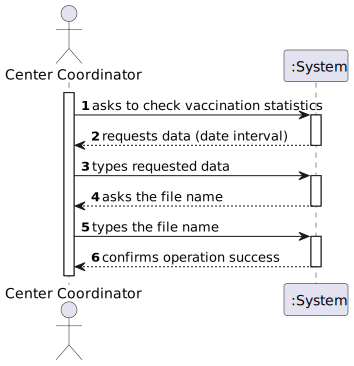
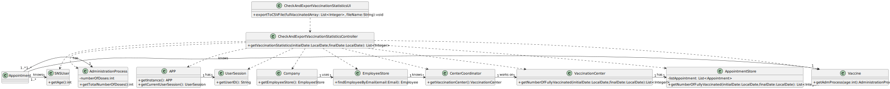

# US 015 - As a Center Coordinator, I intend to check and export vaccination statistics.I want to export, to a csv file, the total number of fully vaccinated users per day.

## 1. Requirements Engineering

### 1.1. User Story Description

*As a Center Coordinator, I intend to check and export vaccination statistics.I want to export, to a csv file, the total number of fully vaccinated users per day.*

### 1.2. Customer Specifications and Clarifications
**From the client clarifications:**
 > **Question:** "In this US should the Center Coordinator check and export the Vaccination Statistics of the Center where he/she works at or should just check and export the Vaccination Statistics of all centers?"
 > 
 > **Answer:**  "The center coordinator can only export statistics from the vaccination center that he coordinates"

 > **Question:** "Should the user introduce the name of the file intended to export the vaccination statistics ?"
 >
 > **Answer:** "The user should introduce the name of the file. 
  
 > **Question:** "Are the vaccination statistics refering only to the fully vaccinated users or refering to something more ?"
 >
 > **Answer:** "Only to fully vaccinated users." 

 > **Question:** "Is the exportation of the CSV file that contains the total number of fully vaccinated users per day, the only feature that needs to be implemented in code, for US15?" 
 >
 > **Answer:** "Yes." 

 > **Question:** "When exporting vaccination statistics,do we export the data from all days available in the system or does the center coordinator chooses the time interval?"
 >
 > **Answer:**  "The user should define a time interval (two dates)."

 > **Question:** "Is there any kind of format our exported data should follow?"
 >
 > **Answer:** "Data format: date; number of fully vaccinated user"

 > **Question:** "In a previous answer you said "Data format: date; number of fully vaccinated user.". So our question is: -> Should we group all sns users fully vaccinated per day of different vaccine types into a total number of that day? Or should we divide the number by vaccine types?"
 > 
 > **Answer:**  "The output data should be the date and the number of fully vaccinated users."

 > **Question:** "In US 15, we only need to used Anova for calculate the values or we need to put the formulas for do the same calculations that Anova do?"
 >
 > **Answer:** "This is not a question for the client. The client only wants to check the results. Please discuss this issue with MATCP teachers."

 > **Question:** "I want to know what you mean about fully vaccinated, it is a person who have take all the doses that are defined for a specific vaccine?"
 >
 > **Answer:** "I already answered this question, please pay more attention to client answers. Again, a SNS user is fully vaccinated when he receives all doses of a given vaccine. A SNS user that has received a single-dose vaccine is considered fully vaccinated and will not take more doses." 

 > **Question:** "Do you want us to show the full vaccinated users in each individual day, or should we show the continuous sum of fully vaccinated users?"
 > 
 > **Answer:**  In a previous answer, the client specified the format of the data: "day, number of fully vaccinated". The client wants the total of fully vaccinated users per day.

 > **Question:**  "On this US we only have to do a funcionality that creates a csv file with the vaccination statistics right?"
 >
 > **Answer:**  I already answered this question. The center coordinator wants to check the statistics in the application and should be able to export to a CSV file.

 > **Question:**  "What do you mean by "check statistics"? Are they supposed to appear on the terminal or console?"
 >
 > **Answer:**  I already answered this question. The center coordinator wants to check the statistics in the application and should be able to export to a CSV file.

 > **Question:**  "Which "vaccination statistics" are you referring to?"
 >
 > **Answer:**  The application should be used to check the total number of fully vaccinated users per day in the vaccination center that the center coordinator coordinates. Please draw appropriate charts.

### 1.3. Acceptance Criteria

* **AC1:** The center coordinator only can export statistics from the center he/she coordinates
* **AC2:** The name of the file should be introduced by the user
* **AC3:** The time interval should be defined by the user
* **AC4:** The ouput data should follow the following format : date; number of fully vaccinated users

### 1.4. Found out Dependencies

*Found out dependency on US001-"As an SNS user, I intend to use the application to schedule a vaccine", since need to exist vaccination appointments to get the number of totally vaccinated users*

*Found out dependency on US002-"As a receptionist at one vaccination center, I want to schedule a vaccine" , since need to exist vaccination appointments to get the number of totally vaccinated users*

*Found out dependency on US003-"As a receptionist, I want to register an SNS user", since the SNS users must exist in order to have appointments*

*Found out dependency on US009-"As an administrator, I want to register a vaccination center to respond to a certain pandemic", since the need to exist vaccination center to administer vaccines

*Found out dependency on US010-"As an administrator, I want to register an Employee", since the Center Coordinator must be already register in the system and assigned to a vaccination center.*
### 1.5 Input and Output Data

**Input data**

* Typed data:
  * a date interval,
  * a name of file

**Output data**

* a CSV file
* (In)success of the operation

### 1.6. System Sequence Diagram (SSD)

### 1.7 Other Relevant Remarks

*n/a*

## 2. OO Analysis

### 2.1. Relevant Domain Model Excerpt

### 2.2. Other Remarks

*n/a*

## 3. Design - User Story Realization

### 3.1. Rationale

**The rationale grounds on the SSD interactions and the identified input/output data.**

| Interaction ID | Question: Which class is responsible for...                          | Answer                                        | Justification (with patterns)                                                                                                                                                                                                         |
|:---------------|:---------------------------------------------------------------------|:----------------------------------------------|:--------------------------------------------------------------------------------------------------------------------------------------------------------------------------------------------------------------------------------------|
| Step 1  		     | 		... interacting with the actor?					                               | CheckAndExportVaccinationStatisticsUI         | Pure Fabrication: there is no reason to assign this responsibility to any existing class in the Domain Model                                                                                                                          |
|                | ... coordinating the US?                                             | CheckAndExportVaccinationStatisticsController | Controller: Represents a use case scenario (ScheduleVaccination)                                                                                                                                                                      |
| Step 2  		     | 		... asking user for data?					                                     | CheckAndExportVaccinationStatisticsUI         | UI is responsible for the interaction with the actor                                                                                                                                                                                  |
| Step 3  		     | 				... temporarily saving the time interval?			                     |           CheckAndExportVaccinationStatisticsController                                        | Controller: Responsible for enabling and handling the flow of operations necessary for the completion of the US                                                                                                                       |
|                | ...knowing all the registered Employees?                             | EmployeeStore                                 | Pure Fabrication/IE: responsible for storing existing Employees                                                                                                                                                                       |                                              |
|                | ...knowing the list of appointments?                                 | VaccinationCenter                             | IE: knows list of its own existing appointments                                                                                                                                                                                       |
|                | ... knowing all the registered appointments in a vaccination center? | AppointmentStore                              | Pure Fabrication: VaccinationCenter delegates responsability to store and perform operations in Appointments supporting high cohesion                                                                                                 |
|                | ...knowing the SNS user data?                                        | SNSUser                                       | IE: knows its own data                                                                                                                                                                                                                |
|                | ... knowing the vaccine's administration process?                    | Vaccine                                       | IE: knows its own data                                                                                                                                                                                                                |
|                | ... knowing the number of doses?                                     | AdministrationProcces                         | IE: knows its own data                                                                                                                                                                                                                |
| Step 4  		     | 		... asking user for data?				                                      |             CheckAndExportVaccinationStatisticsUI                                  | UI is responsible for the interaction with the actor                                                                                                                                                                                  |
| Step 5  		     | 				... temporarily saving the file name?				                        |         CheckAndExportVaccinationStatisticsController                                       | Controller: Responsible for enabling and handling the flow of operations necessary for the completion of the US                                                                                                                       |
| Step 6  		     | 				 ... informing of operation success?			                                                              | CheckAndExportVaccinationStatisticsUI                                                | UI is responsible for the interaction with the actor                                                                                                        |
                                               

### Systematization ##

According to the taken rationale, the conceptual classes promoted to software classes are:

* VaccinationCenter
* Company
* CenterCoordinator
* SNSUser
* AdministrationProcess
* Vaccine

Other software classes (i.e. Pure Fabrication) identified:
* CheckAndExportVaccinationStatisticsUI
* CheckAndExportVaccinationStatisticsController
* EmployeeStore
* AppointmentStore

## 3.2. Sequence Diagram (SD)

**US015_SD_AppointmentStore_getNumberOfFullyVaccinated**

**US015_SD_CheckAndExportVaccinationStatisticsController_getCCVaccinationCenter**

## 3.3. Class Diagram (CD)

# 4. Tests
**Test 1:** Check if the SNS user age is obtained correctly.

	void getAge() {
        SNSUser snsUserTest=new SNSUser("Rui","Rua das Flores","male",123456789,"user1@sem2.pt",LocalDate.of(2003,3,21),2345678,12345678);
        long age=19;
        long ageTest=snsUserTest.getAge();
        assertEquals(age,ageTest);
    }

**Test 2:** Check if the User is found correctly through its email

    void testFindEmployeeByEmail() throws Exception {
    Email email=new Email("user@sem2.pt");
    empStore.getListOfEmployees().add(employee3);
    Employee eTest= empStore.findEmployeeByEmail(email.getEmail());
    assertEquals(eTest,employee3);
    }

# 5. Construction (Implementation)
## Class Appointment Store ##
    public class AppointmentStore{
    //...
    public int[]getNumberOfFullyVaccinated(LocalDate initialDate,LocalDate finalDate) throws Exception {
    long daysInInterval=initialDate.until(finalDate, ChronoUnit.DAYS)+1;
    int[]fullVaccinatedArray=new int[(int)daysInInterval];
    int i =0;
    for (LocalDate day = LocalDate.of(initialDate.getYear(), initialDate.getMonth(),initialDate.getDayOfMonth()); day.isBefore(finalDate) ; day=day.plusDays(1)) {
    int fullVaccinatedCounter=0;
     for (Appointment appointment:listAppointment) {
        if (appointment.checkStateDone()) {
           SNSUser snsUser=appointment.getSnsUser();
            int age=snsUser.getAge();
         LocalDate date=appointment.getDate();
         int numberOfDose=appointment.getVaccineAdministration().getDose().getDoseNumber();
         Vaccine vaccine=appointment.getVaccineAdministration().getVaccine();
         AdministrationProcess admProcess=vaccine.getAdmProcess(age);
          int totalNumberOfDoses=admProcess.getNumberOfDoses();
            if(numberOfDose==totalNumberOfDoses){
                if(date.equals(day)){
              fullVaccinatedCounter=fullVaccinatedCounter+1;
            }
          }
        }
     }
         fullVaccinatedArray[i]=fullVaccinatedCounter;
          i++;
     }
      return fullVaccinatedArray;
     }
## Class Center Coordinator##
    public class CenterCoordinator extends Employee implements Serializable {
        public CenterCoordinator(String id, String name, String employeeId, String address, String phoneNumber, String ccNumber, VaccinationCenter vaccinationCenter) throws Exception {
            super(id, name, RoleStore.getRole(Constants.ROLE_CENTER_COORDINATOR), employeeId, address, phoneNumber, ccNumber);
              this.vaccinationCenter=vaccinationCenter;
        }
        public VaccinationCenter getVaccinationCenter() {
           return vaccinationCenter;
        }
        public void setVaccinationCenter(VaccinationCenter vaccinationCenter) {
         this.vaccinationCenter = vaccinationCenter;
        }
    }

# 6. Integration and Demo

* A new option on the CenterCoordinator menu options was added.

# 7. Observations

* n/a