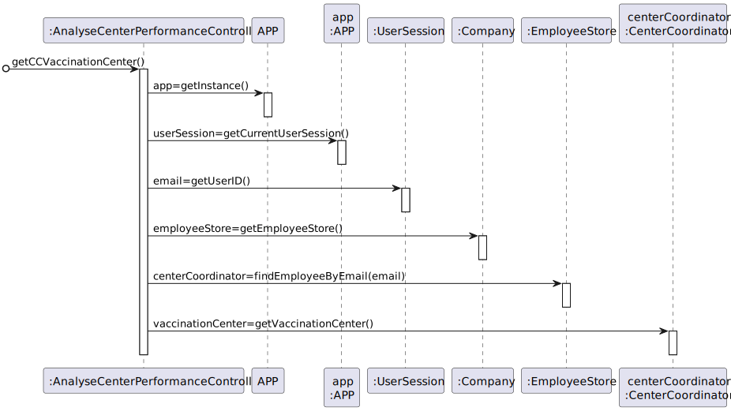
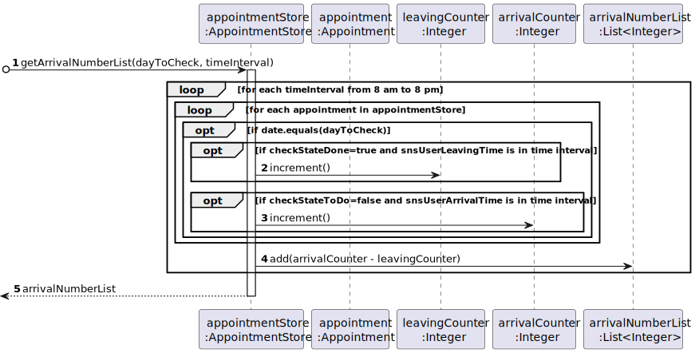

# US 16 - Analyze the performance of a center.

## 1. Requirements Engineering

### 1.1. User Story Description

As a center coordinator, I intend to analyze the performance of a center.

### 1.2. Customer Specifications and Clarifications

**From the specifications document:**

> The goal of this US is to implement a procedure that, for a specific day, and time intervals of m minutes (for m = 30, 20, 10, 5, and 1, for example) chosen by the coordinator of the center, with a daily work from 8 a.m. to 8 p.m., the procedure creates a list of length 720/m (respectively, lists of length 24, 36, 72, 144, 720), where the i-th value of the list is the difference between the number of new clients arriving and the number of clients leaving the center in that i-th time interval.

> Then, the application should implement a brute-force algorithm (an algorithm which examines all the contiguous sublists of the input one) to determine the contiguous sublist with maximum sum. The output should be the input list, the maximum sum contiguous sublist and its sum, and the time interval corresponding to this contiguous sublist (for example, for time intervals of 1 hour, a list of length 12 is created; if, for example, the maximum sum contiguous sublist starts at the 2nd and ends at the 5th entries of the input list, with a sum s, it means that the vaccination center was less effective in responding from 9 a.m. to 1 p.m, with s clients inside the center).

> The performance analysis should be documented in the application user manual (in the annexes) that must be delivered with the application. Also in the user manual, the implemented algorithm should be analyzed in terms of its worst-case time complexity. The complexity analysis must be accompanied by the observation of the execution time of the algorithms, and it should be compared to a benchmark algorithm provided, for inputs of variable size m, with m = 24, 36, 72, 144, 720, in order to observe the asymptotic behavior.

**From the client clarifications:**

> **Question:** From the Sprint D requirements it is possible to understand that we ought to implement a procedure that creates a list with the differences between the number of new clients arriving and the number of leaving clients for each time interval. My question then is, should this list strictly data from the legacy system (csv file from moodle which is loaded in US17), or should it also include data from our system?
>
> **Answer:** US 16 is for all the data that exists in the system.

> **Question:** I would like to know if we could strict the user to pick only those intervals (m) (i.e. 1, 5, 10, 20, 30) as options for analyzing the performance of a center, since picking intervals is dependent on the list which is 720/m (which the length is an integer result). If we let the user pick an interval that results in a non-integer result, this will result in an invalid list since some data for the performance analysis will be lost. Can you provide a clarification on this situation?
>
> **Answer:** The user can introduce any interval value. The system should validate the interval value introduced by the user.

> **Question:** I would like to ask that if to analyse the performance of a center, we can assume (as a pre requirement) that the center coordinator was already attributed to a specific vaccination center and proceed with the US as so (like the center coordinator does not have to choose at a certain point where he is working. This is already treated before this US happens). Could you clarify this?
>
> **Answer:** A center coordinator can only coordinate one vaccination center. The center coordinator can only analyze the performance of the center that he coordinates

> **Question:** In US 16, should the coordinator have the option to choose which algorithm to run (e.g. via a configuration file or while running the application) in order to determine the goal sublist, or is the Benchmark Algorithm strictly for drawing comparisons with the Bruteforce one?
>
> **Answer:** The algorithm to run should be defined in a configuration file.

> **Question:** Is the time of departure of an SNS user the time he got vaccinated plus the recovery time or do we have another way of knowing it?
>
> **Answer:** The time of departure of an SNS user is the time he got vaccinated plus the recovery time.

> **Question:** The file loaded in US17 have only one day to analyse or it could have more than one day(?) and in US16 we need to select the day to analyse from 8:00 to 20:00
>
> **Answer:** The file can have data from more than one day. In US16 the center coordinator should select the day for which he wants to analyse the performance of the vaccination center.

### 1.3. Acceptance Criteria

* **AC1:** The acceptable time intervals must be divisible by 720.
* **AC2:** The daily work hours must be recorded from 8 a.m. to 8 p.m.
* **AC3:** A center coordinator can only coordinate one vaccination center. 
* **AC4:** A center coordinator can only analyze the performance of the center that he coordinates.
* **AC5:** The algorithm to run should be defined in a configuration file.
* **AC6:** The time of departure of an SNS user is the time he got vaccinated plus the recovery time.

### 1.4. Found out Dependencies

* There is a dependency to "US04 - Register The Arrival Of A SNS User" since it is in this User Story that the arrival time of the SNS Users is set
* There is a dependency to "US08 - Record Administration of Vaccine" since it is in this User Story that the leave time of the SNS Users is set

### 1.5 Input and Output Data

**Input Data:**

* Typed data:
    * Day to check  

* Selected data:
    * Time interval (in minutes)

**Output Data:**

* List of the difference between the number of new clients arriving and the number of clients leaving the center
* The maximum sum contiguous sublist
* The sum of the contiguous sublist
* The time interval corresponding to the contiguous sublist
* (In)Success of the operation

### 1.6. System Sequence Diagram (SSD)

### 1.7 Other Relevant Remarks

n/a

## 2. OO Analysis

### 2.1. Relevant Domain Model Excerpt

### 2.2. Other Remarks

n/a

## 3. Design - User Story Realization

### 3.1. Rationale

**The rationale grounds on the SSD interactions and the identified input/output data.**

| Interaction ID | Question: Which class is responsible for...                      | Answer                             | Justification (with patterns)                                                                                            |
|:---------------|:-----------------------------------------------------------------|:-----------------------------------|:-------------------------------------------------------------------------------------------------------------------------|
| Step 1         | ... interacting with the actor?                                  | AnalyseCenterPerformanceUI         | Pure Fabrication: there is no reason to assign this responsibility to any existing class in the Domain Model.            |
|                | ... coordinating the US?                                         | AnalyseCenterPerformanceController | Controller                                                                                                               |
|                | ... knowing the Vaccination Center the Center Coordinator works? | CenterCoordinator                  | IE: knows its own data                                                                                                   |
|                | ... knowing all the registered Employees?                        | EmployeeStore                      | Pure Fabrication: Company delegates responsability to store and perform operations in Employees supporting high cohesion |
|                | ... knowing the list of registered Employees?                    | Company                            | IE: knows list of its own Employees                                                                                      |
|                | ... knowing the user using the system?                           | UserSession                        | IE: cf. A&A component documentation                                                                                      |
|                | ... knowing the current user session?                            | APP                                | IE: has registed all Users Sessions                                                                                      |
| Step 2         | n/a                                                              |                                    |                                                                                                                          |
| Step 3         | ... validate the introduced time interval?                       | AppointmentStore                   | IE: knows how the list is being created                                                                                  | 
|                | ... knowing the AppointmentStore?                                | VaccinationCenter                  | IE: AppointmentStore are defined in the VaccinationCenter                                                                |
| Step 4         | n/a                                                              |                                    |                                                                                                                          |
| Step 5         | ... create the list of Number of Arrivals?                       | AppointmentStore                   | IE/Pure Fabrication : responsible for knowing all appointments                                                           |
|                | ... knowing the Leaving time and Arrival time?                   | Appointment                        | IE: knows its own data                                                                                                   |
|                | ... performing the necessary calculations?                       | MaximumSum                         | Pure Fabrication: there is no reason to assign this responsibility to any existing class in the Domain Model.            |
| Step 6         | ... showing the list, sublist, its sum and its time interval?    | AnalyseCenterPerformanceUI         | Pure Fabrication: UI is responsible for the interaction with the actor                                                   |

### Systematization ##

According to the taken rationale, the conceptual classes promoted to software classes are:

* Company
* Employee
* CenterCoordinator
* VaccinationCenter
* Appointment

Other software classes (i.e. Pure Fabrication) identified:
* AnalyseCenterPerformanceUI
* AnalyseCenterPerformanceController
* APP
* UserSession
* EmployeeStore
* AppointmentStore
* MaximumSum

## 3.2. Sequence Diagram (SD)

## 3.3. Class Diagram (CD)

# 4. Tests

**Test 1:** Checks if the created sublist of maximum sum is created correctly

        @Test
        void testGetMaxSumSublist() {
            int[] list1 = {15, 23, -3, 5, 9, -10}, list2 = {-1, 2, 3, -2, 1,-1};
            int[] expected1 = {15, 23, -3, 5, 9}, expected2 = {2, 3};
            Assertions.assertArrayEquals(expected1, MaximumSum.getMaxSumSublist(list1));
            Assertions.assertArrayEquals(expected2, MaximumSum.getMaxSumSublist(list2));
        }

**Test 2:** Checks if the indexes of the list to create the maximum sum sublist are created correctly

        @Test
        void testFindMaxSumSublistIndexes() {
        int[] list1 = {15, 23, -3, 5, 9, -10}, list2 = {-1, 2, 3, -2, 1,-1};
        int[] expected1 = {0,4}, expected2 = {1, 2};
        Assertions.assertArrayEquals(expected1, MaximumSum.findMaxSumSublistIndexes(list1));
        Assertions.assertArrayEquals(expected2, MaximumSum.findMaxSumSublistIndexes(list2));
        }

# 5. Construction (Implementation)

## Class AppointmentStore

    public class AppointmentStore {

        // ...

        public int[] getArrivalNumberList(LocalDate dayToCheck, int timeInterval) {
            if (!validateTimeInterval(timeInterval))
                throw new InvalidParameterException("Invalid time interval");
            int lenght = 720/timeInterval;
            int[] arrivalNumberList = new int[lenght];
            for (int interval = 0; interval < lenght; interval++) {
                int leavingCounter = 0, arrivalCounter = 0;
                LocalTime lowerTime = LocalTime.of(8,0).plusMinutes(((long) timeInterval * interval));
                LocalTime upperTime = LocalTime.of(8,0).plusMinutes(((long) timeInterval * (interval+1)));
                for(Appointment appointment : listAppointment) {
                    if (dayToCheck.equals(appointment.getDate())) {
                        if (appointment.checkStateDone() && (appointment.getSNSUserLeaveTime().isBefore(upperTime) && !appointment.getSNSUserLeaveTime().isBefore(lowerTime))) {
                            leavingCounter++;
                        }
                        if (!(appointment.checkStateToDo()) && (appointment.getSNSUserArrivalTime().isBefore(upperTime) && !appointment.getSNSUserArrivalTime().isBefore(lowerTime))) {
                            arrivalCounter++;
                        }
                    }
                }
                arrivalNumberList[interval] = arrivalCounter-leavingCounter;
            }
            return arrivalNumberList;
        }

    }

## Class MaximumSum

    public class MaximumSum {

        public static int[] getMaxSumSublist(int[] arrivalNumberList) {
            int[] indexes = findMaxSumSublistIndexes(arrivalNumberList);
            int start = indexes[0], end = indexes[1];
    
            int n = end - start + 1;
            int[] maxSumSublist = new int[n];
            for (int i = 0; i < n; i++) {
                maxSumSublist[i] = arrivalNumberList[start+i];
            }
            return maxSumSublist;
        }

        public int[] findMaxSumSublistIndexes(int[] arrivalNumberList) {
            int size = arrivalNumberList.length;
            int maximumSubArraySum = arrivalNumberList[0];
            int start = 0, end = 0;
    
            for (int left = 0; left < size; left++) {
    
                int currentSum = 0;
    
                for (int right = left; right < size; right++) {
                    currentSum += arrivalNumberList[right];
    
                    if (currentSum > maximumSubArraySum) {
                        maximumSubArraySum = currentSum;
                        start = left;
                        end = right;
                    }
                }
            }
            return new int[] {start, end};
        }
    }

# 6. Integration and Demo

* A new option on the CenterCoordinator menu options was added.

# 7. Observations

n/a