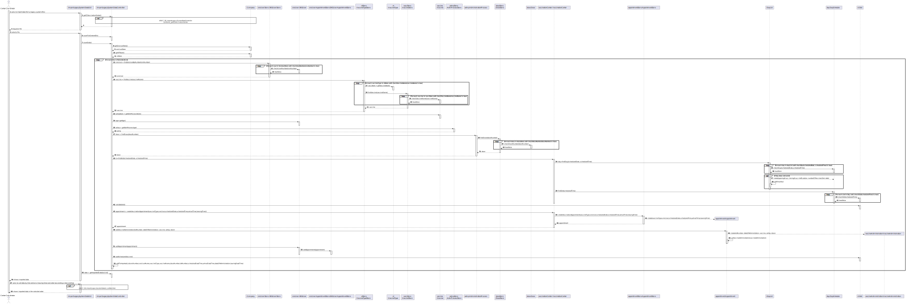

# US 017 - Import Data from Legacy System

## 1. Requirements Engineering

### 1.1. User Story Description

*As a center coordinator, I want to import data from a legacy system that was used in the past to manage centers.*

### 1.2. Customer Specifications and Clarifications

**From the specifitaions document:**

>The Center Coordinator wants to monitor the vaccination process, to see statistics and charts, to evaluate the performance of the vaccination process, generate reports and
analyze data from other centers, including data from legacy systems.

**From the client clarifications:**

>Question: "In the Sprint D requirements is stated that two sorting algorithms should be implemented and that the imported data should be sorted by arrival time or center leaving time. Should each algorithm be capable of both sortings or is one of the algorithms supposed to do one (e.g. arrival time) and the other the remaining sorting criteria (e.g. leaving time)?"
>
>Answer: Each algorithm should be capable of doing both sortings. The application should be prepared to run both algorithms. The algorithm that will be used to sort data should be defined in a configuration file.

>Question: "I was analysing the csv file that should be imported for US17 (the one that is in moodle), I noticed that the date attributes are written like this 5/30/2022 I thought that the date format should be DD/MM/YYYY. I also noticed, that the time is written like this, 9:43, I also thought that the time format should be written like this HH:MM, (in this case it would be 09:43). Are the date and time formats diferent for US17?"
>
>Answer: That file is from a legacy system, that uses a different date and time format. The date and time should be converted when loading the data into the application that we are developing.

>Question: "I noticed that some postal codes in the address does not follow the format of XXXX-YYY. For example some of them are XXXX-Y. Are we supposed to be able to load those users as well?"
>
>Answer: Yes.

>Question: "You already have clarified that when uploading a file from a legacy system the application should check if the SNS Users are already registered and if not, we should register them using US 014. How exactly do you want this to proceed, in case there aren't registered users, should the application ask the center coordinator to select the file with the users data to be uploaded?"
>
>Answer: US14 and US17 are two different features of the system. In US17, if the SNS user does not exist in the system, the vaccination of this SNS user should not be loaded. The system should continue processing the CSV file until all vaccinations are processed.

>Question: "Is there any correct format for the lot number? Should we simply assume that the lot number will always appear like this 21C16-05 ,like it's written in the file, and not validate it?"
>
>Answer: The lot number has five alphanumeric characters an hyphen and two numerical characters (examples: 21C16-05 and A1C16-22 )

>Question: "Should the vaccine named Spikevax, (the one in the given CSV file for US17), be registered before loading the CSV file?"
>
>Answer: Yes.

>Question: "You answered to a previous question saying that the user should be able to sort by ascending or descending order. Should the user choose in the UI, the order in which the information should be presented? Or should this feature be defined in the configuration file?"
>
>Answer: The center coordinator must use the GUI to select the sorting type (ascending or descending).

>Question: "Should the configuration file be defined , manually, before strating the program? Or Should an administrator or another DGS entity be able to alter the file in a user interface? This question is also important for US06 and US16 since these US also use configuration files, will the same process be applied to them?"
>
>Answer: The configuration file should be edited manually.

>Question: "Should we show the sorted list in the GUI or in a exported file?"
>
>Answer: Should show the sorted list in the GUI. In this US the application does not export data...

>Question: "Should the imported data be available only while the program is running or should it be mixed with the schedule, arrival, nurse administration and leaving times registered in the system?"
>
>Answer: This US is used to load data from a legacy system. After loading, the data should be available in the application and can be used in other USs.

### 1.3. Acceptance Criteria

* **AC1:** Two sorting algorithms should be implemented (to be chosen manually by the coordinator), and worst-case time complexity of each algorithm should be documented in the application manual (in the annexes) that must be delivered with the application
* **AC2:** The center coordinator must be able to choose the file that is to be uploaded
* **AC3:** After loading, the data should be available in the application and can be used in other USs
* **AC4:** The lot number has five alphanumeric characters an hyphen and two numerical characters (examples: 21C16-05 and A1C16-22 )

### 1.4. Found out Dependencies

* There is a dependency to "US009 Create Vaccination Center" since there need to be vaccination centers registered in order to save information regarding appointments.
* There is a dependency to "US010 Create Employee" since there needs to be a center coordinator in order to access a specific vaccination center records and import data.
* There is a dependency to "US012 SpecifyNewVaccineType" since there needs to exist vaccine types registered in order to register a vaccination.
* There is a dependency to "US013 SpecifyNewVaccine" since there need to be registered vaccines in order to save imported data relating to the administration of a vaccine.
* There is a dependency to "US14 Load a set of users from a CSV file" since the SNS users need to be saved in the system in order to save a record of a vaccination appointment from the file.

### 1.5 Input and Output Data

**Input Data:**

* Selected data:
    * a file
    * the time criteria for sorting
    * an order to sort data

**Output Data:**

* a table with imported data
* a table with sorted data

### 1.6. System Sequence Diagram (SSD)

### 1.7 Other Relevant Remarks

n/a

## 2. OO Analysis

### 2.1. Relevant Domain Model Excerpt

### 2.2. Other Remarks

n/a

## 3. Design - User Story Realization

### 3.1. Rationale

| Interaction ID | Question: Which class is responsible for...                                       | Answer                           | Justification (with patterns)                                                                                                                                                                              |
|:---------------|:----------------------------------------------------------------------------------|:---------------------------------|:-----------------------------------------------------------------------------------------------------------------------------------------------------------------------------------------------------------|
| Step 1         | ... interacting with the actor?                                                   | ImportLegacySystemDataGUI        | Pure Fabrication: there is no reason to assign this responsibility to any existing class in the Domain Model.                                                                                              |
|                | ... coordinating the US?                                                          | ImportLegacySystemDataController | Controller: Represents a use case scenario                                                                                                                                                                 |
|                | ... knowing the Vaccination Center the Center Coordinator works?                  | CenterCoordinator                | IE: knows its own data                                                                                                                                                                                     |
|                | ... knowing all the registered Employees?                                         | EmployeeStore                    | Pure Fabrication: Company delegates responsability to store and perform operations in Employees supporting high cohesion                                                                                   |
|                | ... knowing the list of registered Employees?                                     | Company                          | IE: knows list of its own Employees                                                                                                                                                                        |
|                | ... knowing the user using the system?                                            | UserSession                      | IE: cf. A&A component documentation                                                                                                                                                                        |
|                | ... knowing the current user session?                                             | APP                              | IE: has registed all Users Sessions                                                                                                                                                                        |
| Step 2         | ... requesting file for posterior treatment?                                      | ImportLegacySystemDataGUI        | UI is responsible for the interaction with the actor                                                                                                                                                       |
| Step 3         | ... transforming the given file into a usable format?                             | ImportLegacySystemDataController | Controller: Responsible for enabling and handling the flow of operations necessary for the completion of the US                                                                                            |
|                | ... knowing the list of registered SNS Users?                                     | Company                          | IE: knows list of its own SNS Users                                                                                                                                                                        |
|                | ... knowing all the registered SNS Users?                                         | SNSUserStore                     | Pure Fabrication: Company delegates responsability to store and perform operations in SNS Users supporting high cohesion                                                                                   |
|                | ... knowing the list of existing vaccine types?                                   | Company                          | IE: knows list of own vaccine types                                                                                                                                                                        |
|                | ... knowing all the existing vaccine types?                                       | VaccineTypeStore                 | Pure Fabrication: Company delegates responsability to store and perform operations in vaccine types supporting high cohesion                                                                               |
|                | ... knowing SNS number of the SNS User?                                           | SNSUser                          | IE: knows its own data                                                                                                                                                                                     |
|                | ... knowing the list of vaccines?                                                 | VaccineType                      | IE: knows its own data                                                                                                                                                                                     |
|                | ... knowing all the vaccines of a vaccine type?                                   | VaccineStore                     | Pure Fabrication: VaccineType delegates responsability to store and perform operations in Vaccines supporting high cohesion                                                                                |
|                | ... knowing the vaccine name?                                                     | Vaccine                          | IE: knows its own data                                                                                                                                                                                     |
|                | ... knowing the list of administration processes?                                 | Vaccine                          | IE: knows its own data                                                                                                                                                                                     |
|                | ... knowing all the administration processes of a vaccine?                        | AdmProcessStore                  | Pure Fabrication: Vaccine delegates responsability to store and perform operations in Administration Processes supporting high cohesion                                                                    |
|                | ... knowing the list doses?                                                       | AdministrationProcess            | IE: knows its own data                                                                                                                                                                                     |
|                | ... knowing all the doses of an administration process?                           | DoseStore                        | Pure Fabrication: AdministrationProcess delegates responsability to store and perform operations in Doses supporting high cohesion                                                                         |
|                | ... knowing the dose number?                                                      | Dose                             | IE: knows its own data                                                                                                                                                                                     |
|                | ... knowing the list of existing days?                                            | VaccinationCenter                | IE: knows list of its own registered Days                                                                                                                                                                  |
|                | ... knowing all the registered days?                                              | DayList                          | Pure Fabrication: VaccinationCenter delegates responsability to store and perform operations in Days supporting high cohesion                                                                              |
|                | ... knowing the date of a day?                                                    | DaySchedule                      | IE: knows its own data                                                                                                                                                                                     |
|                | ... creating and saving a new day?                                                | DayList                          | Creator: Has initializing data of Day and records instances of Day.                                                                                                                                        |
|                | ... knowing the list of slots in a day?                                           | DaySchedule                      | IE: knows list of its own existing slots                                                                                                                                                                   |
|                | ... knowing the time interval of a slot?                                          | Slot                             | IE: knows its own data                                                                                                                                                                                     |
|                | ... knowing if there's vacancy in a slot?                                         | Slot                             | IE: knows its own data                                                                                                                                                                                     |
|                | ... knowing the list of appointments?                                             | VaccinationCenter                | IE: knows list of its own existing appointments                                                                                                                                                            |
|                | ... knowing all the registered appointments in a vaccination center?              | AppointmentStore                 | Pure Fabrication: VaccinationCenter delegates responsability to store and perform operations in Appointments supporting high cohesion                                                                      |
|                | ... creating and saving a new appointment?                                        | AppointmentStore                 | Creator: Has initializing data of Appointment and records instances of Appointment                                                                                                                         |
|                | ... creating and saving own vaccine administration?                               | Appointment                      | Creator: Records instance of VaccineAdministration                                                                                                                                                         |
|                | ... knowingdata of vaccine administration instance?                               | VaccineAdministration            | IE: knows its own data                                                                                                                                                                                     |
|                | ... knowing the list of appointments associated with a SNS User?                  | SNSUser                          | IE: knows list of its own appointments                                                                                                                                                                     |
|                | ... knowing all the sheculed appointments associated with a SNS User?             | SNSUserAppointmentStore          | Pure Fabrication: SNSUser delegates responsability to store and perform operations in Appointments supporting high cohesion                                                                                |
|                | ... saving a reference to a newly created appointment associated with a SNS User? | SNSUserAppointmentStore          | Pure Fabrication: SNSUser delegates responsability to store and perform operations in Appointments supporting high cohesion                                                                                |
|                | ... changing vacancy in a slot?                                                   | Slot                             | IE: knows its own data                                                                                                                                                                                     |
|                | ... saving and retrieving data in a usable format?                                | ImportLegacySystemDataController | Controller: Responsible for enabling and handling the flow of operations necessary for the completion of the US                                                                                            |
|                | ... saving each record in a usable form for UI handling?                          | ImportedDataAux                  | Pure Fabrication: non Domain class responsible for saving one appointment record temporarily for UI operations                                                                                             |
| Step 4         | ... showing imported data?                                                        | ImportLegacySystemDataGUI        | UI is responsible for the interaction with the actor                                                                                                                                                       |
| Step 5         | ... showing options regarding data sorting?                                       | ImportLegacySystemDataGUI        | UI is responsible for the interaction with the actor                                                                                                                                                       |
|                | ... redirecting imported data to chosen algorithm, order and criteria?            | ImportLegacySystemDataController | Controller: Responsible for enabling and handling the flow of operations necessary for the completion of the US                                                                                            |
|                | ... sorting data according to requested criteria and order?	                      | BubbleSort or QuickSort          | Pure Fabrication: there is no reason to assign this responsibility to any existing class in the Domain Model.                                                                                              |
| Step 6         | ... showing sorted imported data?                                                 | ImportLegacySystemDataGUI        | UI is responsible for the interaction with the actor                                                                                                                                                       |

### Systematization ##

According to the taken rationale, the conceptual classes promoted to software classes are:

* CenterCoordinator
* Company
* SNSUser
* VaccineType
* Vaccine
* AdministrationProcess
* Dose
* VaccinationCenter
* DaySchedule
* Slot
* Appointment
* VaccineAdministration

Other software classes (i.e. Pure Fabrication) identified:
* ImportLegacySystemDataGUI
* ImportLegacySystemDataController
* EmployeeStore
* UserSession
* App
* SNSUserStore
* VaccineTypeStore
* AdmProcessStore
* DoseStore
* DayList
* AppointmentStore
* SNSUserAppointmentStore
* ImportedDataAux
* BubbleSort
* QuickSort

## 3.2. Sequence Diagram (SD)

## 3.3. Class Diagram (CD)

# 4. Tests

**Test 1:** Check that BubbleSort is ordering the List of Records.

	@Test
    void bubbleSortTest() {
        OrderedByArrival.add(record4);
        OrderedByArrival.add(record3);
        OrderedByArrival.add(record2);
        OrderedByArrival.add(record1);

        OrderedByLeaving.add(record4);
        OrderedByLeaving.add(record3);
        OrderedByLeaving.add(record2);
        OrderedByLeaving.add(record1);

        UnorderedList.add(record3);
        UnorderedList.add(record2);
        UnorderedList.add(record1);
        UnorderedList.add(record4);

        assertEquals(OrderedByLeaving, BubbleSort.bubbleSort(UnorderedList,9));
        assertEquals(OrderedByArrival, BubbleSort.bubbleSort(UnorderedList,7));
    }

**Test 2:** Check that QuickSort is ordering the List of Records.

    @Test
    void quickSortTest() {
        OrderedByArrival.add(record4);
        OrderedByArrival.add(record3);
        OrderedByArrival.add(record2);
        OrderedByArrival.add(record1);

        OrderedByLeaving.add(record4);
        OrderedByLeaving.add(record3);
        OrderedByLeaving.add(record2);
        OrderedByLeaving.add(record1);

        UnorderedList.add(record3);
        UnorderedList.add(record2);
        UnorderedList.add(record1);
        UnorderedList.add(record4);

        assertEquals(OrderedByLeaving, QuickSort.quickSort(UnorderedList,0,UnorderedList.size()-1,9));
        assertEquals(OrderedByArrival, QuickSort.quickSort(UnorderedList,0,UnorderedList.size()-1,7));
    }

# 5. Construction (Implementation)

## Class ImportLegacySystemController

    public class ImportLegacySystemDataController {

        Properties props = App.getInstance().getProperties();
        int key = Integer.parseInt((String)props.get("Sorting.Algorithm"));
        private Company company;
        private VaccinationCenter vaccinationCenter;
        private SNSUserStore snsUserStore;
        private VaccineTypeStore vtStore;
        private List<List<String>> importedList = new ArrayList<>();
        private List<ImportedDataAux> importedDataAuxList = new ArrayList<>();
        private List<List<String>> fileContentList;

        public ImportLegacySystemDataController() throws Exception {
            this.company = App.getInstance().getCompany();
            getCCVaccinationCenter();
            this.snsUserStore=null;
            this.vtStore=null;
            this.importedList=new ArrayList<>();
            this.importedDataAuxList =new ArrayList<>();
            this.fileContentList=new ArrayList<>();
        }

        /**
        * This function gets the vaccination center of the current center coordinator
        */
        public void getCCVaccinationCenter() throws Exception {
            App app=App.getInstance();
            UserSession userSession=app.getCurrentUserSession();
            Email email=userSession.getUserId();
            EmployeeStore employeeStore=company.getEmployeeStore();
            CenterCoordinator cc=(CenterCoordinator) employeeStore.findEmployeeByEmail(email.getEmail());
            vaccinationCenter=cc.getVaccinationCenter();
        }
    
        /**
        * It reads the file, creates a SNSUser, a VaccineType, a Vaccine, an AdministrationProcess, a Dose, a Slot, and an
        * Appointment, and adds the Appointment to the SNSUser
        */
        public void saveData() throws Exception {
            snsUserStore = company.getSnsUserStore();
            vtStore = company.getVTStore();
            int doseNumber = 1;
            for (List<String> line : fileContentList) {
                SNSUser snsUser = snsUserStore.findSnsUserByNumber(Long.parseLong(line.get(0)));
                VaccineType vt = vtStore.findVaccineType(line.get(1));
                Vaccine vaccine = vtStore.findVaccine(line.get(1));
                AdmProcessStore admpStore = vaccine.getAdmProcessStore();
                int age = snsUser.getAge();
                AdministrationProcess admp = admpStore.getAdmProcess(age);
                if (line.get(2).equalsIgnoreCase("primeira"))
                    doseNumber = 1;
                else if (line.get(2).equalsIgnoreCase("segunda"))
                    doseNumber = 2;
                else if (line.get(2).equalsIgnoreCase("terceira"))
                    doseNumber = 3;
                Dose dose = admp.findDose(doseNumber);
                DateTimeFormatter formatter = DateTimeFormatter.ofPattern("M/d/yyyy H:m");
                Slot sl = vaccinationCenter.findSlot(LocalDateTime.parse(line.get(4),formatter).toLocalDate(),LocalDateTime.parse(line.get(4),formatter).toLocalTime());
                sl.validateSlot();
                Appointment appointment = vaccinationCenter.createVaccinationAppointment(vt,snsUser,LocalDateTime.parse(line.get(4),formatter).toLocalDate(),LocalDateTime.parse(line.get(4),formatter).toLocalTime(),
                        LocalDateTime.parse(line.get(5),formatter), LocalDateTime.parse(line.get(7),formatter));
                appointment.addVaccineAdministration(line.get(3),LocalDateTime.parse(line.get(6),formatter),vaccine,admp,dose);
                snsUser.addAppointment(appointment);
                sl.addScheduledVaccine();
                addToImportedList(line.get(0),snsUser.getName(), vt.getDescription(),line.get(1), String.valueOf(doseNumber),line.get(3),line.get(4),line.get(5),line.get(6),line.get(7));
            }
        }
        /**
        * It sorts the imported data by arrival time
        *
        * @param sortingOrder 0 for ascending, 1 for descending
        * @return A list of ImportedDataAux objects.
        */
        public List<ImportedDataAux> sortByArrivalTime(int sortingOrder){
            int index = 7;
            if(key==0&&sortingOrder==0){
                return orderedImportedDataAuxList(BubbleSort.bubbleSort(importedList,index));
            }else if(key==1&&sortingOrder==0){
                return orderedImportedDataAuxList(QuickSort.quickSort(importedList,0,importedList.size()-1,index));
            }else if(key==1&&sortingOrder==1){
                List<List<String>> orderedOutputList = BubbleSort.bubbleSort(importedList,index);
                Collections.reverse(orderedOutputList);
                return orderedImportedDataAuxList(orderedOutputList);
            }else if(key==0&&sortingOrder==1){
                List<List<String>> orderedOutputList = QuickSort.quickSort(importedList,0,importedList.size()-1,index);
                Collections.reverse(orderedOutputList);
                return orderedImportedDataAuxList(orderedOutputList);
            }
            return null;
        }

        /**
        * It sorts the imported data by leaving time, using the algorithm and sorting order specified by the user
        *
        * @param sortingOrder 0 for ascending, 1 for descending
        * @return A list of ImportedDataAux objects.
        */
        public List<ImportedDataAux> sortByLeavingTime(int sortingOrder){
            int index = 9;
            if(key==0&&sortingOrder==0){
                return orderedImportedDataAuxList(BubbleSort.bubbleSort(importedList,index));
            }else if(key==1&&sortingOrder==0){
                return orderedImportedDataAuxList(QuickSort.quickSort(importedList,0,importedList.size()-1,index));
            }else if(key==1&&sortingOrder==1){
                List<List<String>> orderedOutputList = BubbleSort.bubbleSort(importedList, index);
                Collections.reverse(orderedOutputList);
                return orderedImportedDataAuxList(orderedOutputList);
            }else if(key==0&&sortingOrder==1){
                List<List<String>> orderedOutputList = QuickSort.quickSort(importedList,0,importedList.size()-1,index);
                Collections.reverse(orderedOutputList);
                return orderedImportedDataAuxList(orderedOutputList);
            }
            return null;
        }

        /**
        * This function returns a list of imported data
        *
        * @return A list of ImportedDataAux objects.
        */
        public List<ImportedDataAux> getImportedDataAuxList() {
            return importedDataAuxList;
        }

       /**
        * This function adds a line to the importedList and importedDataAuxList
        *
        * @param snsUserNumber The number of the user in the SNS system.
        * @param snsUserName The name of the person who received the vaccine
        * @param vaccineType The type of vaccine (e.g. "Vacina BCG")
        * @param vaccineName The name of the vaccine
        * @param doseNumber dose number
        * @param lotNumber lot number of the vaccine
        * @param scheduledDateTime the date and time the user was scheduled to receive the vaccine
        * @param arrivalDateTime The date and time the patient arrived at the health center.
        * @param dateOfAdministration the date the vaccine was administered
        * @param leavingDateTime the time the patient left the health center
        */
        public void addToImportedList(String snsUserNumber, String snsUserName, String vaccineType, String vaccineName, String doseNumber, String lotNumber, String scheduledDateTime, String arrivalDateTime,
                                  String dateOfAdministration, String leavingDateTime) {
            List<String> importedLine = List.of(snsUserNumber,snsUserName,vaccineType,vaccineName,doseNumber,lotNumber,scheduledDateTime,arrivalDateTime,dateOfAdministration,leavingDateTime);
            this.importedList.add(importedLine);
            this.importedDataAuxList.add(new ImportedDataAux(snsUserNumber,snsUserName,vaccineType,vaccineName,doseNumber,lotNumber,scheduledDateTime,arrivalDateTime,dateOfAdministration,leavingDateTime));

        }

        /**
        * It reads a file line by line, and if the line is valid, it adds it to a list of lists
        *
        * @param file The file to be read.
        */
        public void saveFileContent(File file) throws IOException {
            BufferedReader br = new BufferedReader(new FileReader(file));
            String firstLine = br.readLine();
            String currentLine = br.readLine();
            while (currentLine != null){
                try{
                    List<String> lineRecord = List.of(currentLine.split(";"));
                    this.fileContentList.add(lineRecord);
                }catch(Exception e){
                    System.out.println("Line with invalid data. Skipping...");
                }
                currentLine=br.readLine();
            }
            br.close();
        }

        /**
        * It takes a list of lists of strings, and returns a list of ImportedDataAux objects
        *
        * @param orderedOutputList The list of lists of strings that we want to convert to a list of ImportedDataAux objects.
        * @return A list of ImportedDataAux objects.
        */
        public List<ImportedDataAux> orderedImportedDataAuxList(List<List<String>> orderedOutputList){
            List<ImportedDataAux> orderedImportedDataAuxList = new ArrayList<>();
            for (List<String> importedDataAux: orderedOutputList) {
                orderedImportedDataAuxList.add(new ImportedDataAux(importedDataAux.get(0),importedDataAux.get(1),importedDataAux.get(2),importedDataAux.get(3),importedDataAux.get(4),importedDataAux.get(5),importedDataAux.get(6),
                        importedDataAux.get(7),importedDataAux.get(8),importedDataAux.get(9)));
            }
            return orderedImportedDataAuxList;
        }
    }

## Class Company

    public class Company implements Serializable {
        /**
        * Designation of the Company
        */
        private String designation;
        private transient AuthFacade authFacade;
        /**
        * Store responsible for storing Mass Vaccination Centers
        */
        private MVCenterStore mvCenterStore;
        /**
        * Store responsible for storing Vaccine Types
        */
        private VaccineTypeStore vaccineTypeStore;
        /**
        * Store responsible for storing SNS Users
        */
        private SNSUserStore snsUserStore;
        /**
        * Store responsible for storing Healthcare Centers
        */
        private HCCenterStore hcCenterStore;
        /**
        * Vaccine type of the ongoing outbreak
        */
        private VaccineType ongoingOutbreak;
        /**
        * Store responsible for storing Roles
        */
        private static RoleStore roleStore;
        /**
        * Store responsible for storing Employees
        */
        private EmployeeStore empStore;
        public Company(String designation) {
            if (StringUtils.isBlank(designation))
                throw new IllegalArgumentException("Designation cannot be blank.");

            this.designation = designation;
            this.authFacade = new AuthFacade();
            this.mvCenterStore =new MVCenterStore();
            this.vaccineTypeStore=new VaccineTypeStore();
            this.roleStore=new RoleStore();
            this.empStore=new EmployeeStore();
            this.snsUserStore=new SNSUserStore();
            this.hcCenterStore=new HCCenterStore();
        }

        public String getDesignation() {
            return designation;
        }

        public void setAuthFacade(AuthFacade authFacade) {
            this.authFacade=authFacade;
        }

        public AuthFacade getAuthFacade() {
            return authFacade;
        }
        /**
        * This function returns the Store of Mass Vaccination Centers
        *
        * @return mvCenterStore
        */
        public MVCenterStore getMVCenterStore(){
            return mvCenterStore;
        }
        /**
        *
        * Returns the store responsible for storing vaccine types.
        * @return vaccineTypeStore
        */
        public VaccineTypeStore getVTStore(){
            return vaccineTypeStore;
        }

        /**
        *
        * Returns the store responsible for storing Roles
        * @return roleStore
        */
        public static RoleStore getRoleStore(){
            return roleStore;
        }
        /**
        *
        * Returns the store responsible for storing Employees
        *
        * @return employeeStore
        */
        public EmployeeStore getEmployeeStore(){
            return empStore;
        }

        /**
        * This function returns the Store of SNS Users
        *
        * @return snsUserStore
        */
        public SNSUserStore getSnsUserStore(){return snsUserStore;}

        /**
        * Returns tne store responsible for storing Healthcare Centers
        * @return hcCenterStore
        */
        public HCCenterStore getHCCenterStore() {
            return hcCenterStore;
        }

        /**
        * Create and return a new instance of a vaccine using Vaccine DTO information
        * @param vaccineDto vaccine Dto with the atributes to create the vaccine
        * @param vt vaccine type to create the vaccine
        * @return created vaccine
        */
        public Vaccine createVaccine(VaccineDto vaccineDto, VaccineType vt) {
            return vaccineTypeStore.createVaccine(vaccineDto, vt);
        }

        /**
        * Validate the vaccine
        * @param vaccine vaccine to be validated
        * @return vaccine validated
        */
        public boolean validateVaccine(Vaccine vaccine, VaccineType selectedVt) {
            return vaccineTypeStore.validateVaccine(vaccine, selectedVt);
        }

        /**
        * Save the created vaccine
        * @param vaccine vaccine to be saved
        * @param vt vaccine type to save the vaccine
        */
        public void saveVaccine(Vaccine vaccine, VaccineType vt) {
            vaccineTypeStore.saveVaccine(vaccine, vt);
        }

        /**
        * Gets a list of employee roles
        * @return list of Roles
        */
        public List<Role> getRoles() {
            return this.roleStore.getListOfRole();
        }
        /**
         * Compares a certain object with the wanted object
         * @param o Object to be compared
         * @return Comparison between objects
         */

        @Override
        public boolean equals(Object o) {
            if (this == o) return true;
            if (!(o instanceof Company)) return false;

            Company company = (Company) o;
    
            if (!Objects.equals(designation, company.designation)) return false;
            if (!Objects.equals(authFacade, company.authFacade)) return false;
            if (!Objects.equals(mvCenterStore, company.mvCenterStore))
                return false;
            if (!Objects.equals(vaccineTypeStore, company.vaccineTypeStore))
                return false;
            if (!Objects.equals(roleStore, company.roleStore)) return false;
            return Objects.equals(empStore, company.empStore);
        }
        /**
        * This function returns the Ongoing Outbreak Vaccine Type
        *
        * @return The vaccine type of the ongoing outbreak.
        */
        public VaccineType getOngoingOutbreakVaccineType(){
            return this.ongoingOutbreak;
        }
        /**
        * This function sets the Ongoing Outbreak Vaccine Type to the vaccineType parameter recived
        *
        * @param vaccineType The vaccine type that is being the outbreak.
        */
        public void setOngoingOutbreakVaccineType(VaccineType vaccineType){
              ongoingOutbreak=vaccineType;
        }

        public VaccineTypeStore getVaccineTypeStore(){
            return vaccineTypeStore;
        }
    }

# 6. Integration and Demo

n/a

# 7. Observations

n/a